## AWS VPC

### Public Network

`공용 네트워크`란 모든 사람들이 접속할 수 있고, 그것을 통해 다른 네트워크나 인터넷에 접속할 수 있는 네트워크의 한 종류입니다. `사설 네트워크`와 대조적으로 접근 제한이 없거나 적기 때문에, 보안 위협에 주의해야 합니다. 일반적인 `인터넷`이 이에 해당합니다.

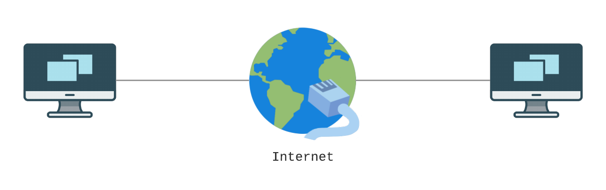

 

### Private Network

이에 반해, `사설 네트워크`는 특정 그룹만 접근할 수 있도록 `외부 접근이 물리적으로 차단된` 비공개 네트워크입니다. 외부 침입을 원천적으로 막을 수 있지만, 전용선을 공사해야 하기 때문에 매우 비쌉니다. 일반적인 `인트라넷`이 이에 해당합니다.

하지만 아무리 `비공개 네트워크`라고 하더라도 `공개 네트워크의 데이터`가 필요한 경우가 있습니다. 이러한 경우에는 `아웃바운드 트래픽`이 허용될 수 있습니다.

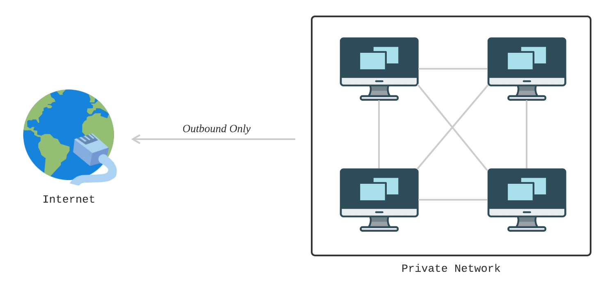

 

### VPN (Virtual Private Network)

`사설 네트워크`는 보안적 측면에서 굉장히 유용하지만 유연성이 매우 떨어집니다. 예를 들어, 보안상의 이유로 `회사 데이터베이스`와 `일반 직원`을 서로 다른 네트워크로 분리하고 싶다면, 기존 인터넷선을 들어내고 다시 설치해야 합니다. 이를 방지하기 위해 `가상 사설 네트워크`를 사용하는데, 물리적으로는 연결되어 있을지라도 `논리적으로는 서로 다른 네트워크`인 것 처럼 행동합니다.

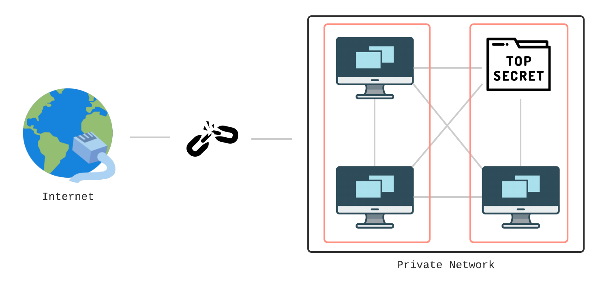

이것은 모든 디바이스의 트래픽이 `VPN Server`를 경유했기 때문에 가능한데, 중간에서 `VPN Server`가 논리적으로 같은 네트워크에만 트래픽이 흐르도록 제어하고 있기 때문입니다.

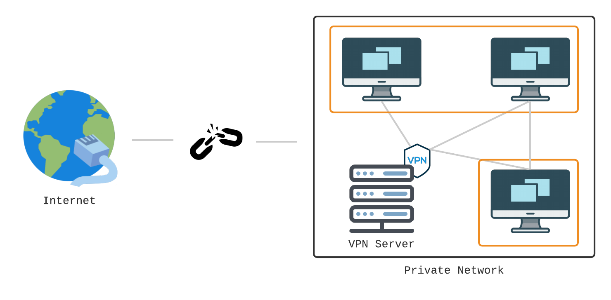

이것은 `VPN Server`와 닿을수만 있다면 `Private Network`에 참가할 수 있다는 것을 의미합니다. `VPN Server`가 `Public Network`에 참가하고 있다면, 외부에서 사설망에 접근하는 것이 가능하며, 보통 `재택근무` 또는 `본사-지사`간의 네트워크 구축을 위해 사용됩니다.

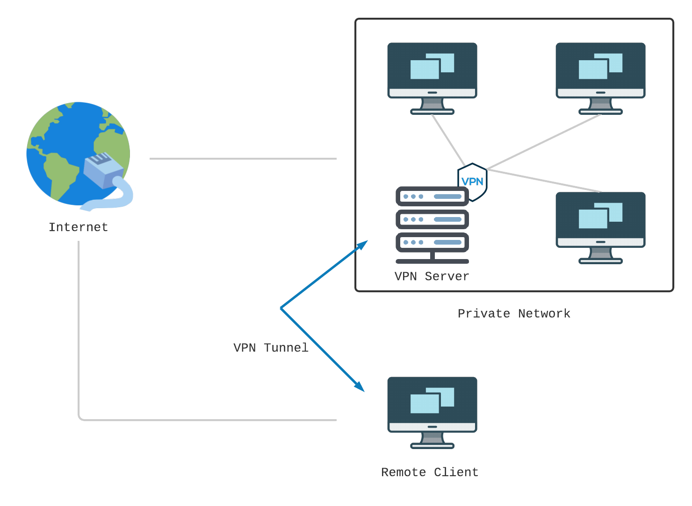

여기서 `VPN Server`와 `Remote Client`의 통신은 `VPN Tunnel`이라고 불리는 암호화된 통신을 사용하기 때문에 중간에서 감청당할 위험이 없습니다.

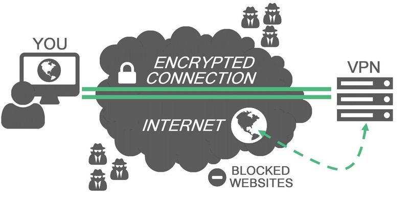

 

### VPC (Virtual Private Cloud)

대부분의 아마존 서비스는 `VPC`라고 불리는 `가상 사설망` 위에서 동작합니다. 각각의 `VPC`는 별도의 네트워크처럼 동작하며, 기본적으로는 같은 `VPC`에 있지 않다면 트래픽이 닿지 않습니다. (하지만 서로다른 VPC간의 통신이 필요한 경우, `VPC Peering`을 통해 해결할 수 있습니다.)

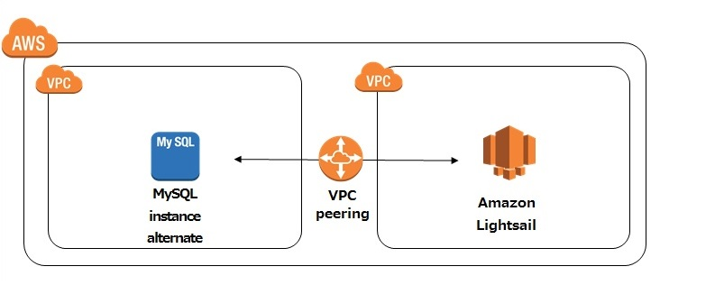

`VPC`는 사설망이기 때문에 `RFC-1918`에서 정해놓은 `사설 아이피 대역`을 사용해야 합니다. `VPC`를 생성할 때 `CIDR`형태로 사용하고자 할 대역을 명시적으로 주어야 하며, 각각의 `VPC`는 별도의 네트워크이므로 아이피 대역이 겹쳐도 문제되지 않습니다.

**(RFC-1918) 사설 아이피 대역:**

| Class | First IP    | Last IP         | CIDR           |
| :---: | ----------- | --------------- | -------------- |
|   A   | 10.0.0.0    | 10.255.255.255  | 10.0.0.0/8     |
|   B   | 172.16.0.0  | 172.31.255.255  | 172.16.0.0/12  |
|   C   | 192.168.0.0 | 192.168.255.255 | 192.168.0.0/16 |

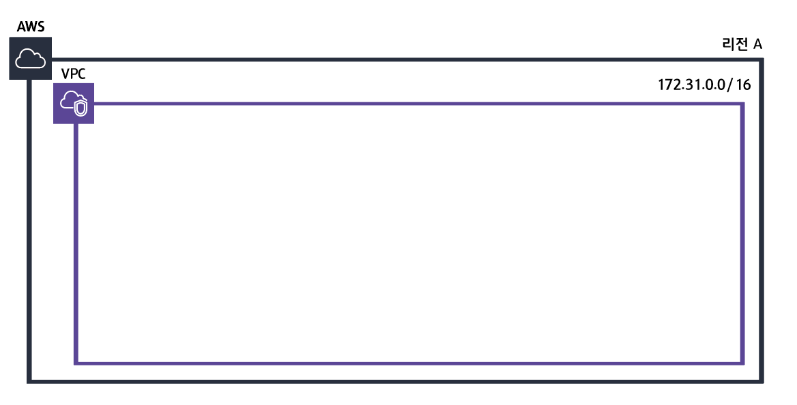

 

### Subnet

만들어진 `VPC`는 `Subnet`이라는 더 작은 네트워크로 나눠지며, 각각의 서브넷은 `가용영역`이란 것을 선택할 수 있습니다. 가용영역이란 `한 리전 내에서 물리적으로 분리된 데이터센터`로, 하나의 리전은 여러개의 가용영역으로 이루어져 있기 때문에, 같은 서비스를 여러 가용영역에 복제시켜 운용하면 높은 수준의 서비스 가용성을 얻을 수 있습니다.

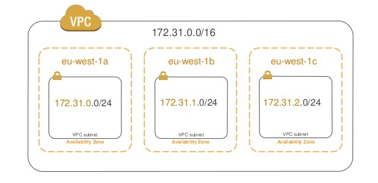

 

### Routing Table

각각의 `서브넷`은 하나의 라우팅 테이블을 가지고 있습니다. 기본적으로는 자신이 속한 `VPC`내부에서만 통신할 수 있으나, 필요하다면 라우팅 테이블을 건드려서 확장할 수 있습니다.

 

#### 내부 VPC 서브넷과 통신하기

라우팅 테이블의 기본값이며 `같은 VPC`의 서브넷과만 통신할 수 있습니다. `라우팅 테이블에 적힌 CIDR 블럭`이 `VPC CIDR 블럭`과 동일한 것에 주목해주세요. `172.31.0.0/16`으로 요청된 트래픽은 `Local`에서 찾도록 설정되어 있으므로 `VPC 내부`에서 해당 인스턴스를 찾게 됩니다.

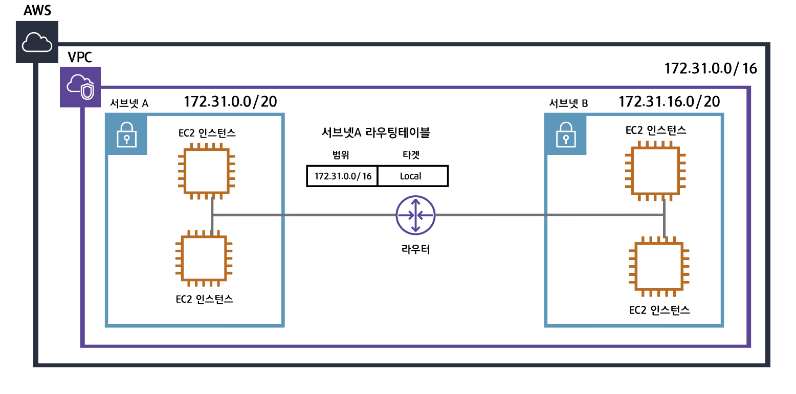

 

#### 외부 VPC 서브넷과 통신하기

`VPC Peering`을 사용하면 외부 서브넷과 통신할 수 있습니다. 아래 그림에서 양쪽의 `VPC`가 `VPC Peering`으로 연결되어 있고, `위쪽의 양 서브넷`의 라우팅 테이블이 반대쪽의 `Subnet ID`를 가르키고 있으므로 통신할 수 있습니다.

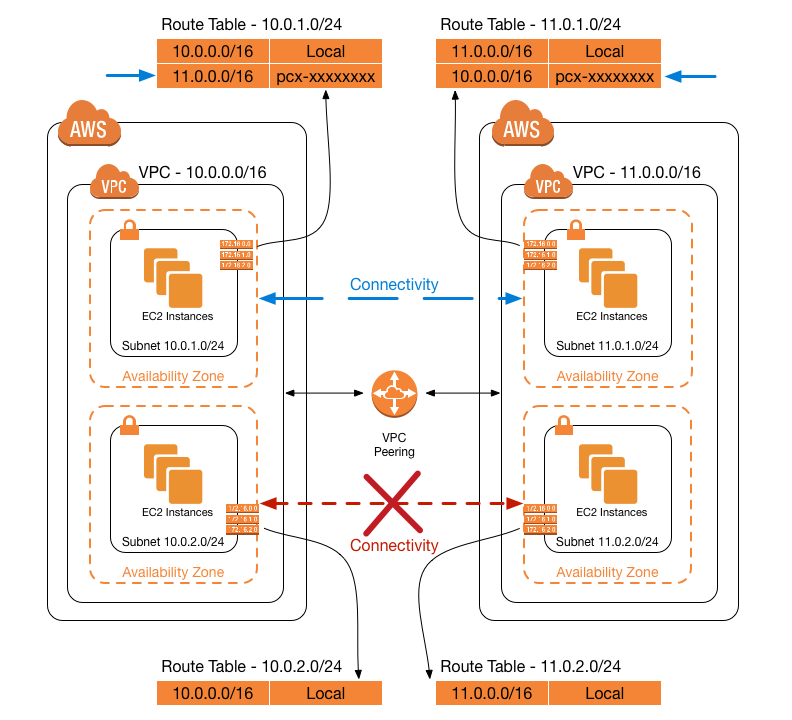

 

#### Inbound/Outbound Network

라우팅 테이블의 기본값을 보면 알 수 있듯이, 기본적으로 `Subnet`은 보안을 위해 인터넷과 연결되어 있지 않습니다. 이런 경우에는 `인터넷 게이트웨이(IGA)`를 라우팅 테이블에 추가하여 인터넷과 통신할 수 있습니다. 이렇게 연결된 서브넷은 외부의 누군가가 접근할 수 있으므로 `Public Subnet`이라고 부릅니다.

 

아래에서 라우팅 테이블이 `0.0.0.0/0 -> IGA A`로 설정된 것에 주목해주세요. 라우팅 테이블의 위에 적힌 순서대로 `172.31.0.0/16`와 일치하는지 먼저 검사하고, 그렇지 않은 트래픽은 `0.0.0.0/0 -> IGA A`을 통해 인터넷으로 흘러나갑니다. (`0.0.0.0/0`은 모든 아이피 대역을 가르키므로 어떤 아이피에도 일치합니다.)

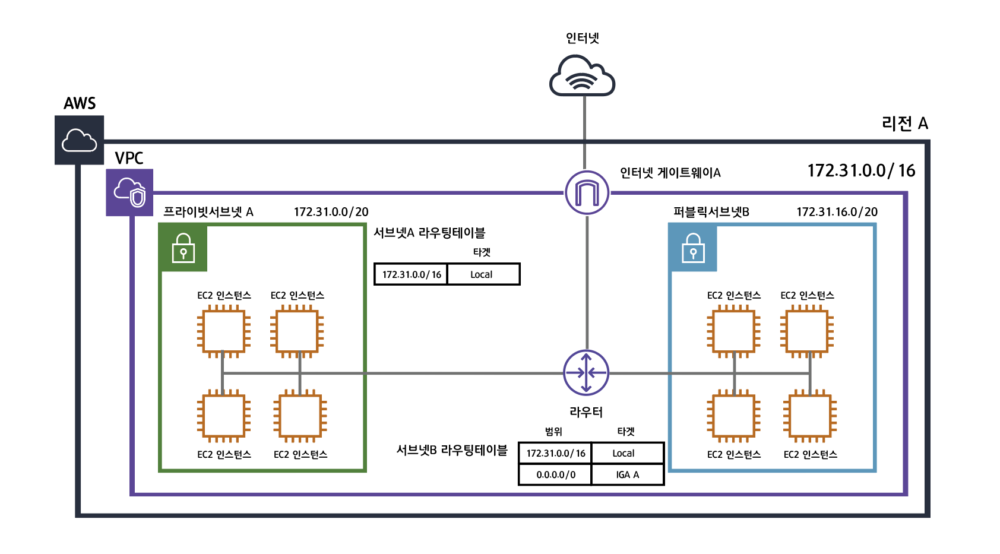

 

#### Outbound Only Network

인터넷에서 정보만 긁어오는 경우에는 `NAT`를 통해 인터넷과 연결하는 것이 좋습니다. 인터넷으로 나가는 트래픽은 허용하지만, 인터넷에서 들어오는 트래픽을 차단하기 때문입니다. 이렇게 외부 인터넷에서 접근할 수 없는 서브넷을 `Private Subnet`이라고 부릅니다.

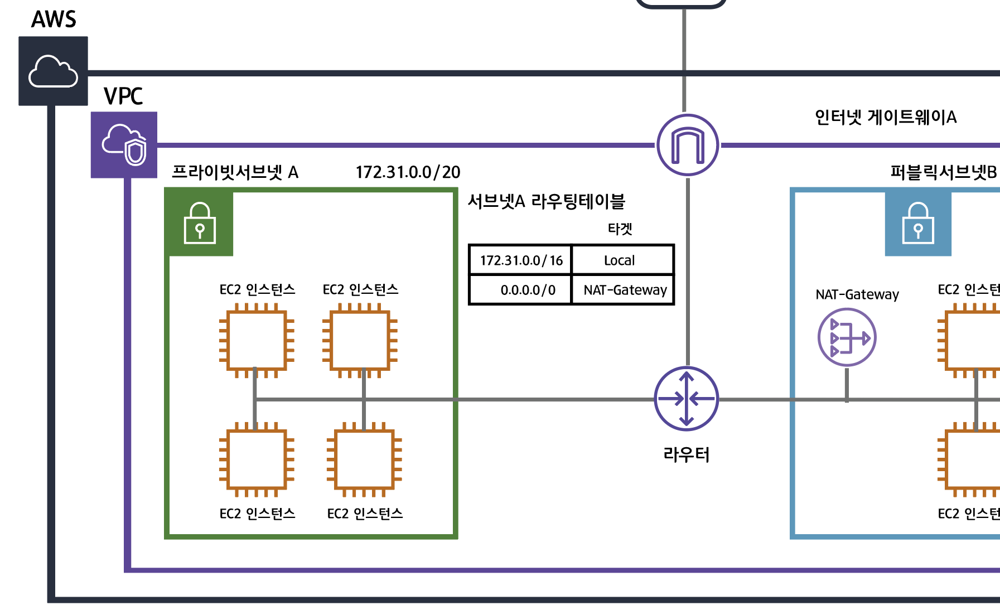

 

### References

-   [해리의 유목코딩](https://medium.com/harrythegreat/aws-%EA%B0%80%EC%9E%A5%EC%89%BD%EA%B2%8C-vpc-%EA%B0%9C%EB%85%90%EC%9E%A1%EA%B8%B0-71eef95a7098)
