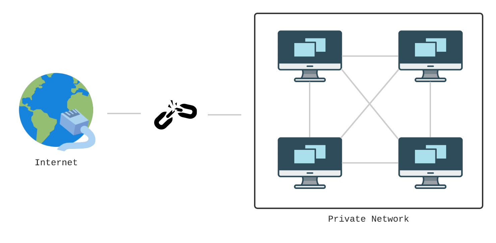

## AWS VPC

### Public Network

`공용 네트워크`란 모든 사람들이 접속할 수 있고, 그것을 통해 다른 네트워크나 인터넷에 접속할 수 있는 네트워크의 한 종류입니다. `사설 네트워크`와 대조적으로 접근 제한이 없거나 적기 때문에, 보안 위협에 주의해야 합니다. 일반적인 `인터넷`이 이에 해당합니다.

 

### Private Network

이에 반해, `사설 네트워크`는 특정 그룹만 접근할 수 있도록 `외부 접근이 물리적으로 차단된` 비공개 네트워크입니다. 외부 침입을 원천적으로 막을 수 있지만, 전용선을 공사해야 하기 때문에 매우 비쌉니다. 일반적인 `인트라넷`이 이에 해당합니다.

하지만 아무리 `비공개 네트워크`라고 하더라도 `공개 네트워크의 데이터`가 필요한 경우가 있습니다. 이러한 경우에는 `아웃바운드 트래픽`이 허용될 수 있습니다.

 

### VPN (Virtual Private Network)

`사설 네트워크`는 보안적 측면에서 굉장히 유용하지만 유연성이 매우 떨어집니다. 예를 들어, 보안상의 이유로 `회사 데이터베이스`와 `일반 직원`을 서로 다른 네트워크로 분리하고 싶다면, 기존 인터넷선을 들어내고 다시 설치해야 합니다. 이를 방지하기 위해 `가상 사설 네트워크`를 사용하는데, 물리적으로는 연결되어 있을지라도 `논리적으로는 서로 다른 네트워크`인 것 처럼 행동합니다.

이것은 모든 디바이스의 트래픽이 `VPN Server`를 경유했기 때문에 가능한데, 중간에서 `VPN Server`가 논리적으로 같은 네트워크에만 트래픽이 흐르도록 제어하고 있기 때문입니다.

이것은 `VPN Server`와 닿을수만 있다면 `Private Network`에 참가할 수 있다는 것을 의미합니다. `VPN Server`가 `Public Network`에 참가하고 있다면, 외부에서 사설망에 접근하는 것이 가능하며, 보통 `재택근무` 또는 `본사-지사`간의 네트워크 구축을 위해 사용됩니다.

여기서 `VPN Server`와 `Remote Client`의 통신은 `VPN Tunnel`이라고 불리는 암호화된 통신을 사용하기 때문에 중간에서 감청당할 위험이 없습니다.

