## HTTP

`HyperText Transfer Protocol`의 약자로 인터넷에서 데이터를 주고받을 수 있는 방식을 나타냅니다. 이름에서 볼 수 있듯이 초창기에는 `텍스트 메세지`를 주고받는 `텍스트 프로토콜`이였지만, 많은 개선이 이루어지면서 `이진 메세지`를 주고받는 `이진 프로토콜`로 변화하였습니다.

<br/>

개선되는 와중에 `모든 HTTP 버전이 공유하는 공통점`은 줄어들었지만, `HTTP/3.0` 기준으로 지금까지 변하지 않았던 특성을 나열하면 다음과 같습니다 :

-   `요청`를 보내면 `응답`를 반환하는 형태로 통신한다.
-   `IP` 프로토콜 위에서 동작한다.
-   `상태가 없는(stateless)` 연결을 사용한다.

<br/>

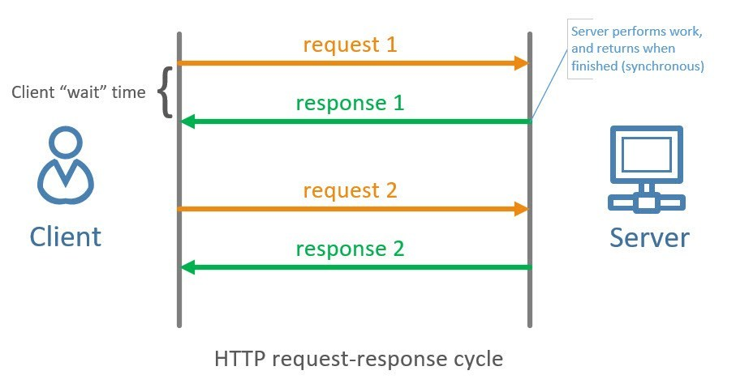

---

## HTTP 0.9

`HTTP`의 초기 버전입니다. 요청 메세지가 한 줄로 되어있기 때문에 `원 라인 프로토콜`로 불리기도 합니다. `GET으로 요청하면 파일 내용을 반환하는 것`이 전부 입니다. 따라서, 초기 버전에서는 `GET`밖에 없으며 `응답코드`같은 것도 존재하지 않았습니다.

**요청 메세지 :**

```http
GET /mypage.html
```

**응답 메세지 :**

```http
<HTML>
A very simple HTML page
</HTML>
```

---

## HTTP 1.0

초기 버전은 융통성이 없기 때문에, 다음 버전인 `HTTP 1.0`에서 좀 더 유연한 요청과 응답이 가능해지도록 개선되었습니다. 구체적으로는 다음과 같이 변경되었습니다.

-   요청 메세지는 `프로토콜 버전`을 명시해야 합니다.
-   요청 메세지는 `커스텀 헤더`를 함께 전달할 수 있습니다.
-   응답 메세지는 `상태 코드`를 반환하여 요청의 성공여부를 명시해야 합니다.
-   `Content-Type`의 추가로 `텍스트 이외의 파일`도 응답받을 수 있게 되었습니다.

**요청 메세지 :**

```http
GET /myimage.gif HTTP/1.0
User-Agent: NCSA_Mosaic/2.0 (Windows 3.1)
```

**응답 메세지 :**

```http
200 OK
Date: Tue, 15 Nov 1994 08:12:32 GMT
Server: CERN/3.0 libwww/2.17
Content-Type: text/gif
(image content)
```

<br/>

그러나 해당 버전에서는 `커넥션 유지`에 치명적인 단점이 있습니다. 단일 문서에 포함된 자원들을 요청할 때 마다 새로운 커넥션이 생성되기 때문입니다. 이러한 생명주기 방식을 `Short-lived`라고 합니다.

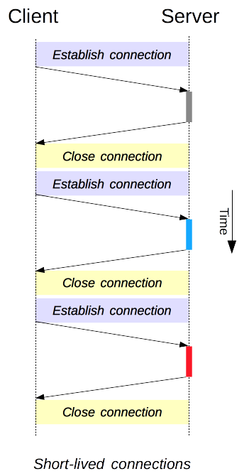

---

## HTTP 1.1

`HTTP 1.0`가 발표되자마자 다양한 연구가 폭발적으로 이루어지고 `표준화`를 위한 논의도 빠르게 진행되었습니다. `HTTP 1.1`은 `HTTP 1.0`가 발표된 지 `몇 달`만에 발표되었으며, 모호점을 명확히하고 성능의 개선도 이루어졌습니다.

<br/>

-   `커넥션을 재사용`시켜 단일 문서에 포함된 자원을 받을 때의 성능을 향상시켰습니다. 이러한 생명주기 방식을 `Persistent`라고 합니다.

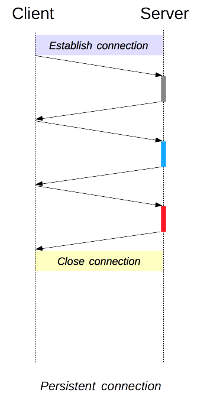

<br/>

-   `Persistent`에 더해 `Pipelining`이 추가되어 `선행 요청`이 완료되기 전에 `후행 요청`을 보낼 수 있게 되었습니다. 이것으로 응답 레이턴시가 획기적으로 줄어들었습니다.

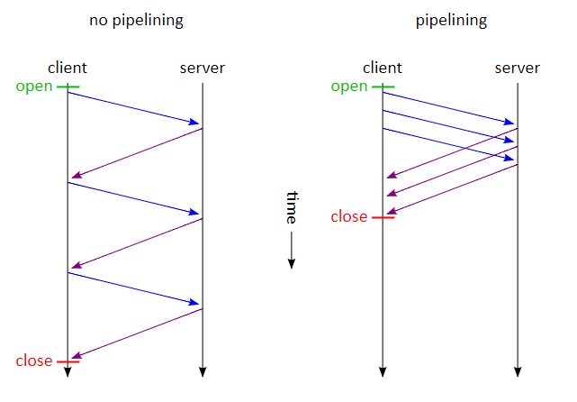

<br/>

-   하나의 응답이 여러개의 `청크`로 쪼개져 반환될 수 있습니다.

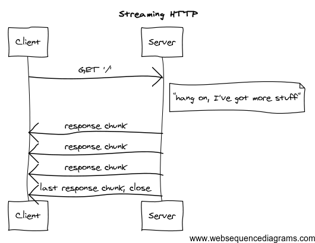

<br/>

-   `캐시 제어 매커니즘`이 추가되었습니다. 로컬에 유효한 캐시가 존재한다면 `304 Not Modified`를 반환하고, 캐싱된 데이터를 사용합니다.


<br/>

-   언어, 인코딩과 같은 필드가 추가되어 `가장 적절한 버전`을 요청할 수 있도록 `서버가 주도하는 컨텐츠 협상`이 가능해졌습니다.

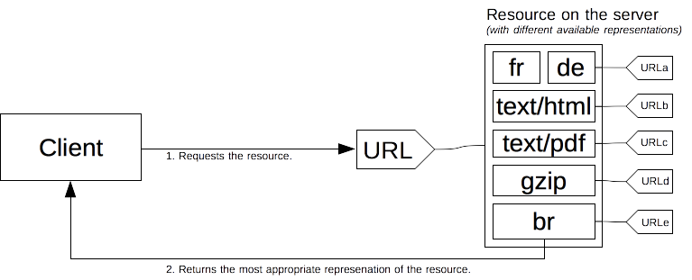

<br/>

-   `Host` 헤더가 추가되어, 동일한 IP를 여러개의 도메인으로 호스팅할 수 있게 되었습니다.

<br/>

**요청 메세지 :**

```http
GET /static/img/header-background.png HTTP/1.1
Host: developer.cdn.mozilla.net
User-Agent: Mozilla/5.0 (Macintosh; Intel Mac OS X 10.9; rv:50.0) Gecko/20100101 Firefox/50.0
Accept: */*
Accept-Language: en-US,en;q=0.5
Accept-Encoding: gzip, deflate, br
Referer: https://developer.mozilla.org/en-US/docs/Glossary/Simple_header
```

**응답 메세지 :**

```http
200 OK
Age: 9578461
Cache-Control: public, max-age=315360000
Connection: keep-alive
Content-Length: 3077
Content-Type: image/png
Date: Thu, 31 Mar 2016 13:34:46 GMT
Last-Modified: Wed, 21 Oct 2015 18:27:50 GMT
Server: Apache

(image content of 3077 bytes)
```

---

## 이후에 이루어진 업데이트

-   보안 프로토콜인 `TLS`가 추가되었습니다.
-   `POST, PUT, ...`과 같은 메소드가 추가되었습니다.
-   `CORS`에 대한 보안정책이 일부 완화되었습니다.
-   `Connection` 헤더를 사용하여 이번 요청이 끝나고 커넥션의 종료여부를 결정할 수 있습니다.

---

## HTTP 2.0

그러나 `HTTP 1.1`도 많은 약점을 지니고 있습니다. `Body`를 압축할 수는 있지만 `Header`는 압축할 수 없으며, 커넥션을 재사용한다 하더라도 `여러번의 요청`이 만들어지는 것은 어쩔 수 없고, 무엇보다도 `HOL Blocking`라고 불리는 이슈가 치명적입니다. `HTTP 2.0`은 이러한 이슈를 해결하기 위해 등장했습니다.

<br/>

### HOL Blocking

`HOL Blocking`은 첫 번째 요청이 유실되었을 때 `TCP`는 첫 번째 요청을 복구하려고 시도하는데, 이러한 과정에서 다음 요청들의 처리가 늦어지는 현상을 말합니다. 일반화해서 말하면 `N+1번째 요청`은 `N번째 요청`이 끝나야 처리될 수 있는데, `N번째 요청`이 유실되었기 때문에 `N+1번째 부터의 모든 요청`이 블럭되는 이슈입니다.

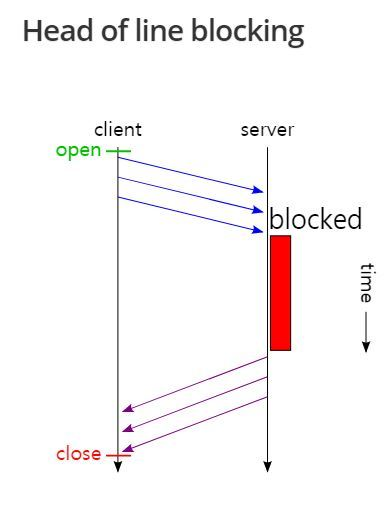

<br/>

이러한 이슈는 `순서대로 요청을 처리하려는 성질`때문에 발생하므로, `HTTP 2.0`은 이러한 이슈를 해결하기 위해 순서대로 요청을 처리하지 않습니다. `후행 요청`이 먼저 처리되면, `선행 요청`보다 먼저 반환될 수 있다는 것이죠. 이러한 특징을 `멀티플렉싱`이라고 합니다.

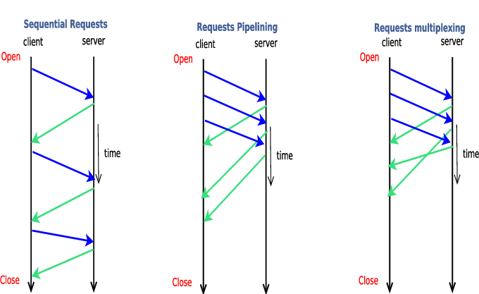

<br/>

### Stream & Server Push

`HTTP 1.x`는 단일 문서에 포함된 자원을 얻어야 할 때 마다 `요청`이 발생합니다. `HTTP 1.1`에 이르러서는 커넥션을 재활용하기 때문에 부담이 덜하지만, 여러번의 요청이 발생하는 것은 결코 가볍지 않습니다.

<br/>

이러한 이슈를 해결하기 위해 `HTTP 2.0`은 `텍스트 프로토콜`에서 `바이너리 프로토콜`로 변화했고 `Server Push`라는 기능도 함께 추가했습니다. 따라서, 서버와 클라이언트는 `양방향 스트림`을 사용하여 한번의 요청으로 여러번 데이터를 읽고 쓸 수 있습니다. 즉, `HTTP 2.0`에서는 필요한 모든 자원을 `한번에` 클라이언트에게 밀어넣을 수 있다는 것이죠.

<br/>

하지만, 이제부터 `요청 메세지`와 `응답 메세지`는 `바이너리`로 작성되어 `요청 프레임`과 `응답 프레임`으로 바뀌기 때문에 더 이상 사람이 편하게 읽을 수 없습니다.

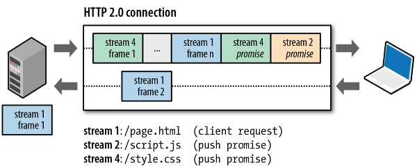

<br/>

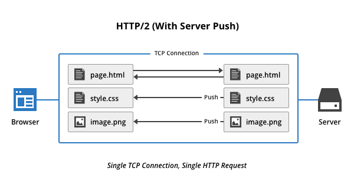

<br/>

이러한 기능을 대화로 풀어내면 다음과 같습니다.

```text
클라 : 인덱스 페이지를 보내줘!
서버 : 알았어. 여기 html 파일이야. 그런데 이 이미지랑 js로 필요할걸? 같이 보내줄게!
클라 : html 파일을 훑어봤어. 그런데 이미지랑 동영상이 필요한 것 같은데?
       어? 이미 보내줬네? 고마워!
```

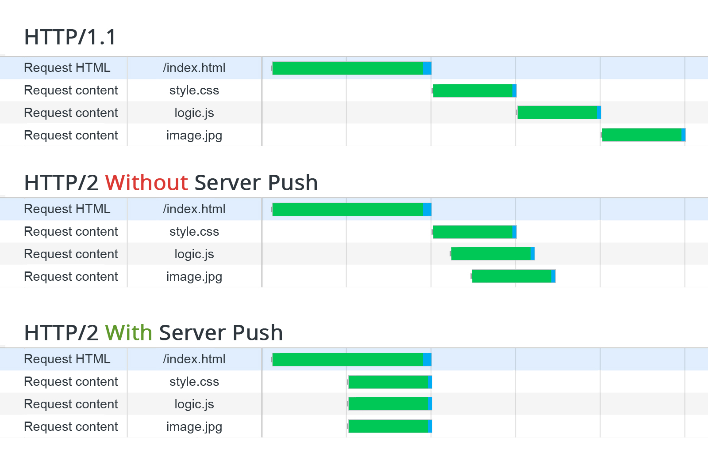

<br/>

### Header Compression

`HTTP 1.x`는 단일 문서에 포함된 자원들을 요청할 때 마다, 모든 헤더값을 반복해서 보내야만 했습니다. 그러나 `HTTP 2.0`은 `선행 요청 프레임`에 사용된 헤더값을 재사용하여 헤더를 압축할 수 있습니다.

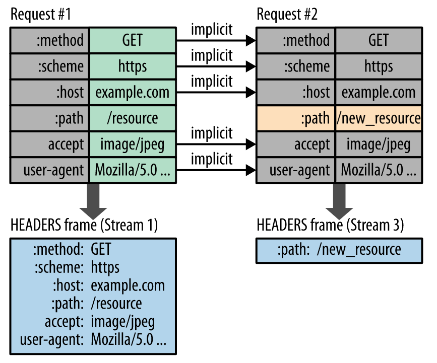

---

## HTTP 3.0

`HTTP 2.0`도 약점을 가지고 있습니다. `HTTP Layer`에서 발생한 `HOL Blocking`은 막을 수 있었지만, `TCP Layer`에서 발생한 `HOL Blocking`은 막을 수 없었기 때문이죠. 또한 `TCP`는 신뢰성을 매우 중시하기 때문에 대량의 데이터를 주고받는데에 약했고, 현대와 같이 대량의 데이터를 주고받는데 적합하지 않다는 의견이 나왔습니다. 어차피 `HTTP 2.0`이 `Stream`을 기반으로 했기 때문에 `HTTP 3.0`은 `UDP`기반의 프로토콜인 `QUIC`으로 갈아타게 되었습니다.

<br/>

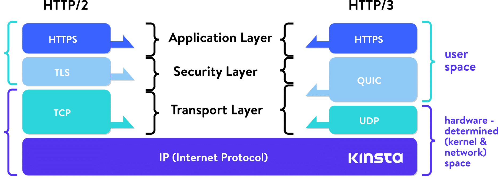

<br/>

### Design

기본적인 디자인은 `HTTP 2.0`과 동일합니다. `TCP`대신에 `UDP`위에서 동작한다는 것만 다를 뿐이죠. 덕분에 `HOL Blocking`이 완벽하게 해결되었고, 대량의 데이터를 빠르게 주고받을 수 있게 되었습니다.

<br/>

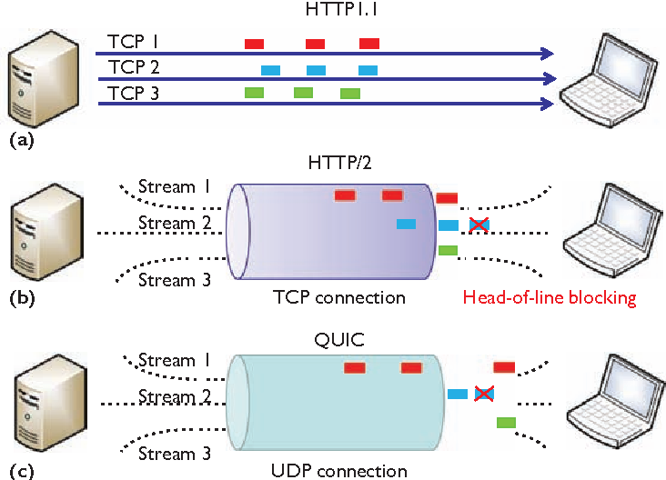

<br/>

### UDP는 믿을만하나요?

`UDP` 자체는 신뢰성이 없지만, `UDP`를 응용해서 만든 프로토콜은 신뢰성이 생길 수 있습니다.
