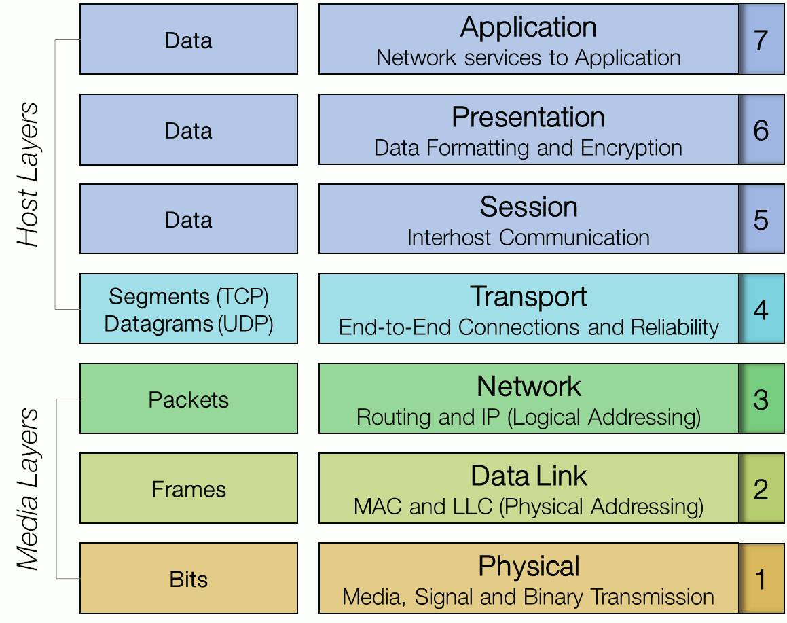
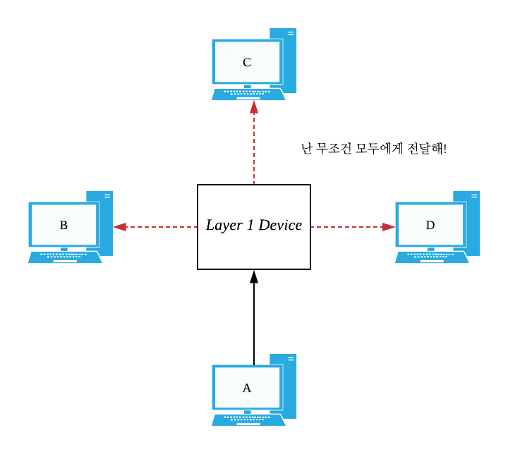
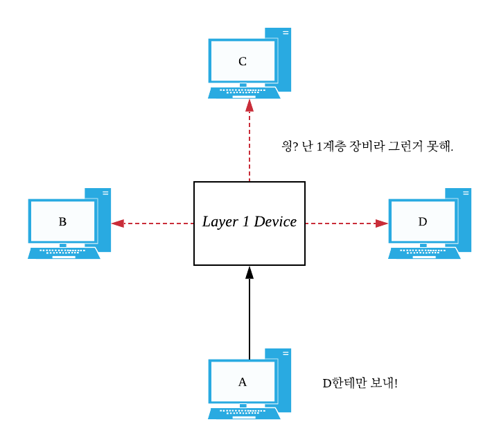
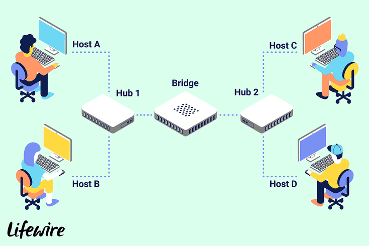
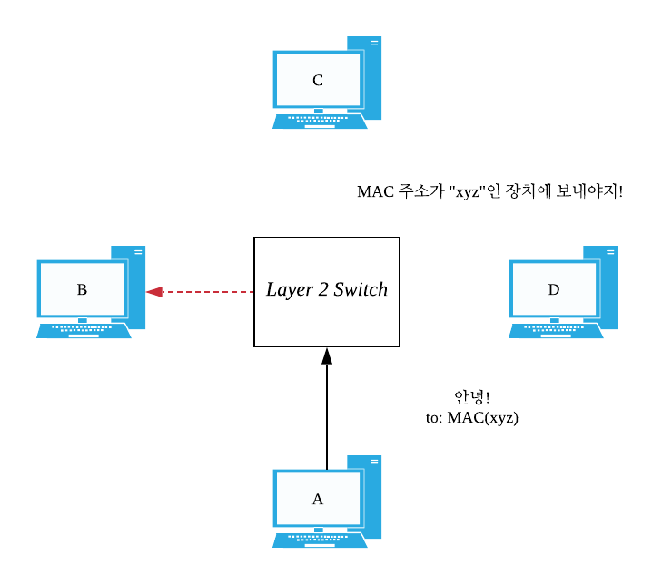
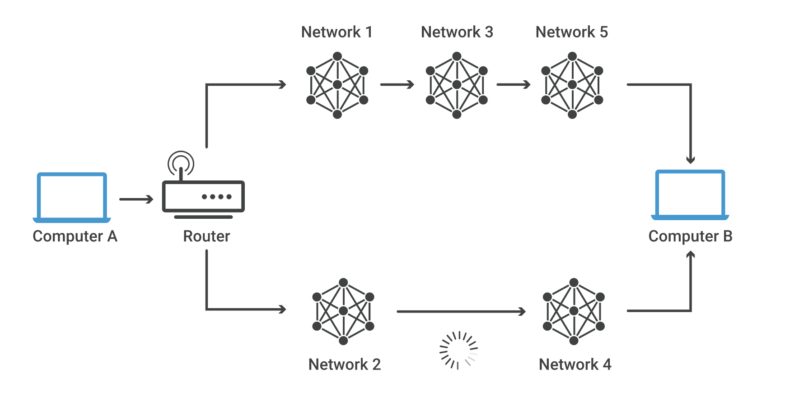
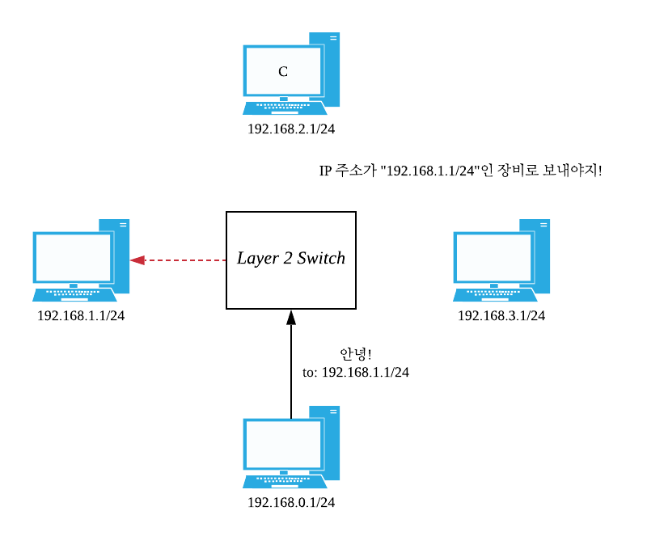
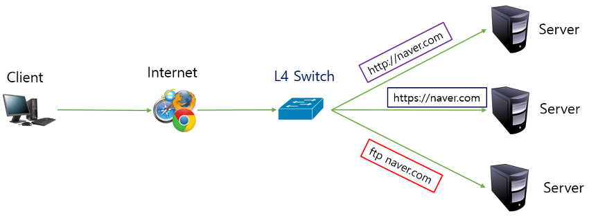

## OSI 7 Layer

1984년에 `ISO 표준화 기구`에서 제정된, 공개된 시스템 사이의 통신(`Open-System-Interconnection`) 규칙을 의미합니다. 모두가 이것을 따름으로써 통신규격이 통일되고, 오류가 발생했을 때 어느 단계에서 문제가 발생했는지 쉽게 찾아낼 수 있습니다.

 

 

---

## 물리 계층 (Layer 1)

장치간의 커넥션 그 자체를 의미하는 계층입니다. `유선 통신`과 `무선 통신`이 전기신호를 해석하는 방식이 다르듯이, 어떻게 `전기신호`를 받아들이고 해석할건지에 대해 결정합니다. 이 계층에서 문제가 발생했다는 것은 `전기신호를 받아들이지 못했다`라는 것이며, 실생활에서 흔히 발생하는 예시를 들어보자면 `케이블을 연결하지 않았다거나`, `케이블이 고장났다거나`, `와이파이에 접속이 되지 않았다던가` 하는 문제들입니다.

 

**대표적인 프로토콜 :**

-   `Wi-Fi Protocol (802.11)` : **와이파이 전기신호**를 해석하는 방법을 가르키는 프로토콜
-   `USB physical layer protocol` : **USB 케이블 전기신호**를 해석하는 방법을 가르키는 프로토콜
-   `Ehternet physical layer Protocol` : **인터넷 케이블 전기신호**를 해석하는 방법을 가르키는 프로토콜

 

**대표적인 장비 :**

`조건없이 전기신호를 전달하는 장비`가 여기에 속합니다. 여기서 중요한 것은 `조건없이` 전기신호를 전달한다는 것인데, `선택적으로 송신지를 선택하는 작업`은 다음 레이어인 `Data-Link Layer`의 책임이기 때문입니다.

-   `케이블` : 전기신호 전달.
-   `리피터` : 중간에서 전기신호 증폭하여 전달.
-   `허브` : 여러개의 장치를 연결하여, 한 쪽에서 들어온 전기신호를 나머지 장치 모두에게 전달.

 

`허브`가 1계층의 장비인 이유는 `연결만 되어 있다면` 나머지 장비들에게 조건없이 전기신호를 전달하기 때문입니다.

`조건없이`의 반대말은 `선택적으로`라는 것을 생각하면 쉽게 이해할 수 있습니다.

 

**해당 계층의 기능 :**

-   `비트 동기화`

물리적 계층은 클럭을 제공하여, 송신자와 수신자의 통신을 `비트 레벨로 동기화`합니다.

 

-   `비트 레이트 제어`

물리적 계층은 `1초 당 전송되는 비트 수`를 제한할 수 있습니다.

 

-   `전송 모드 관리`

물리적 계층은 `수신/송신`모드를 설정할 수 있습니다. `수신/송신`모드는 `단방향`/`반이중`/`전이중` 중 하나입니다.

---

## 데이터 링크 계층 (Layer 2)

`Point to Point`. 다른 말로 `서로 물리적으로 연결된 두 네트워크 장비 사이의 통신`을 정의하는 계층입니다. 따라서 현재 계층에서 다루는 것은 `로컬 네트워크 통신`이며, 현재 계층만으로는 `다른 네트워크` (a.k.a `인터넷`)에 접속할 수 없습니다. `데이터 링크 계층`은 2가지의 하위 레이어로 구성되어 있습니다.

 

-   `Logical Link Control Layer`

두 네트워크 장비의 커넥션을 `논리적으로 표현`하는 방법을 정의합니다. `(각 네트워크 장비에 고유 주소를 부여하고) 주소를 이용한 링크` 또는 `(두 네트워크 장비 사이에 터널을 생성하고) 터널을 이용한 링크`가 주로 활용됩니다.

 

-   `Medium Access Control Layer`

줄여서 `MAC`. 데이터를 송신하려는 `네트워크 장비`는 여러개지만 `전송 매체`는 한정되어 있으므로 `누가 전송 매체를 사용할지 결정`하는 역할을 맡습니다. 현재 소유권을 가지고 있는 네트워크 장치만이 데이터를 전송할 수 있으며, `전송 매체`에 대한 `경합/충돌`을 막습니다.

 

**대표적인 프로토콜 :**

-   `MAC` : 각 네트워크 장비에 고유한 `MAC 주소`를 할당하고, 해당 주소를 함께 전달하여 통신.
-   `PPP` : 두 네트워크 장비간 `직렬 터널`을 생성하여 통신.
-   `ARP` : 3계층 프로토콜인 `IP Protocol`과 함께 사용되며 `IP 주소`를 통해 `네트워크 장비 주소`를 찾아내어 통신.

 

**대표적인 장비 :**

`L1 장비`와 달리 `특정 조건에 의해 송신지가 변경`될 수 있습니다.

 

-   `브릿지` : 두 네트워크 장비를 연결하지만, 선택적으로 트래픽을 차단.

 

-   `L2 스위치` : `네트워크 장치 주소`를 기반으로 특정 네트워크 장치에만 트래픽을 전달.

 

**해당 계층의 기능 :**

-   `프레임화`

여러개의 비트를 묶어 하나의 프레임으로 만듭니다. 프레임의 처음과 끝에 특수한 비트 패턴을 붙여서 각각의 프레임을 구분합니다.

 

-   `물리적 주소 부여`

각각의 네트워크 장비에 `고유 주소`를 할당합니다. `고유 주소`는 해당 프레임이 어느 네트워크 장비로 전달되어야 하는지 구분하기 위해 사용됩니다.

 

-   `오류 제어`

프레임의 손상을 감지하고 재전송을 요청할 수 있습니다.

 

-   `흐름 제어`

수신측과 송신측의 `초당 받을 수 있는 프레임 수`는 동일해야 합니다.

 

-   `액세스 제어`

여러개의 네트워크 장비가 `전송 매체(Layer 1 Device)`를 공유하고 있는 경우, `충돌/경합`이 발생하지 않도록 사용권을 결정합니다.

---

## 네트워크 계층 (Layer 3)

`Hop to Hop`. 다른 말로 `서로다른 네트워크 위에 존재하는 장비간 통신`을 정의하는 계층이며, 이 계층에 이르러서야 `인터넷`에 접속할 수 있습니다. 따라서, `인터넷`과 관련 기능. `인터넷`으로 연결된 각각의 장비를 유니크하게 식별하기 위해 `고유 주소`를 부여한다던가, `최단 경로`로 데이터를 전달하는 것은 `Layer 3`의 책임입니다.

 

**대표적인 프로토콜 :**

-   `IPv4`
-   `IPv6`

`IP Protocol`은 널리 사용되는 프로토콜이므로 좀 더 분석해보겠습니다. 해당 프로토콜만으로는 `신뢰성`을 보장할 수 없습니다. 즉,

-   도착한 패킷의 순서가 뒤죽박죽일 수 있고,
-   같은 패킷이 두 번 이상 전달될 수 있고,
-   어떤 패킷이 손상되거나,
-   아예 패킷이 사라질 수 있습니다.

따라서 `신뢰성`을 보장하는 것은 `TCP`와 같은 상위 계층의 책임입니다.

 

**대표적인 장비 :**

-   `라우터` : 특정 `인터넷 고유 주소`를 갖는 디바이스에 최적의 경로로 데이터를 전달하는 장비. 예를 들어서, 아래 사진에서 `1-3-5`보다 `2-4`가 `거치는 네트워크 수`는 적지만, `2-4`의 중간에서 지연이 발생했다면, 데이터는 더 빠른 경로인 `1-3-5`를 통해 전달된다.

 

-   `L3 스위치` : `인터넷 고유 주소`를 기반으로 특정 네트워크 장치에만 트래픽을 전달.

 

위의 두 장비의 이름은 서로 다르지만, 현대에 이르러서는 `같은 장비`로 취급됩니다. `특정 네트워크 주소`를 갖는 디바이스로 트래픽을 전달하는 것이 전부이기 때문이죠. 즉, `라우터`가 하는 일은 `L3 스위치`도 할 수 있고. `L3 스위치`가 하는 일은 `라우터`도 할 수 있습니다.

---

## 전송 계층 (Layer 4)

`Process to Process`. 다른 말로 `서로 다른 프로세스 사이의 통신`을 정의하는 계층입니다. 하나의 컴퓨터는 여러개의 `포트`로 나누어져 있으므로 `어떤 포트로 데이터를 전달할지 결정`하는 역할을 하며, 사실상 `하드웨어와 밀접한 마지막 계층`이므로 `최종적인 신뢰성 보장`을 여기서 수행합니다. (그러나, 해당 계층의 어떤 프로토콜은 신뢰성 보장을 수행하지 않을 수 있습니다.)

 

**대표적인 프로토콜 :**

-   `TCP` : 신뢰성을 보장하는 `연결 지향성 프로토콜`
-   `UDP` : 신뢰성을 보장하지 않는 `비연결 프로토콜`
-   `QUIC` : 신뢰성을 보장하는 `UDP` 기반의 프로토콜

`UDP`가 그렇듯이 모든 프로토콜이 항상 `신뢰성`을 보장하지 않으며, `QUIC`이 그렇듯이 `UDP` 기반의 프로토콜이 모두 `비신뢰성`인 것은 아닙니다. 추가적인 로직을 통해 `UDP`에 `신뢰성`을 부여한 새로운 프로토콜을 만들 수 있기 때문입니다.

 

**대표적인 장비 :**

-   `L4 스위치` : `포트번호`를 기반으로 특정 네트워크 장치에만 트래픽을 전달.

 

-   `방화벽` : 권한이 없는 사용자의 트래픽을 차단합니다.

 

-   `로드 밸런서` : 특정 `포트번호`로 집중된 트래픽을 각기다른 서버로 분산시킵니다.

 

**해당 계층의 기능 :**

-   `(옵션) 신뢰성 보장` : 데이터가 올바르고 정확하게 도착했는지 보장합니다.
-   `통신 다중화` : 하나의 장치를 여러개의 포트로 나누어 `논리적인 다중 연결`을 구현합니다.

---

## 세션 계층 (Layer 5)

네트워크에서 이루어진 일회용 연결을 `세션`이라고 합니다. 해당 계층은 `세션`(`논리적 연결`)을 관리하는 역할을 수행합니다. `세션`을 새롭게 생성하거나 삭제하고, `세션`이 비정상적으로 끊기면 복구를 시도하거나, `세션`의 성능을 높이기 위해 다양한 행동을 수행합니다. `TCP/IP 모델`에서는 `Layer 5, 6, 7`이 `응용 계층`으로 통합되고 `Layer 5`로 부릅니다.

 

**대표적인 프로토콜 :**

-   `SMB` (`Server Message Block`)

`TCP/IP`를 기반으로 하는 `파일 공유 프로토콜`입니다. 삼바(`Samba`)가 사용하고 있는 프로토콜로 유명합니다. 어째서 이게 `세션 계층`에 포함되었는지 궁금할 수 있는데, 위에서 설명했듯이 `TCP/IP 모델`을 기반으로 하는 프로토콜은 `Layer 5, 6, 7`를 합쳐서 `Layer 5`로 보기 때문입니다.

 

-   `RPC` (`Remote Procedure Call`)

외부 서버에 위치한 함수를 쉽게 사용할 수 있게 도와주는 `원격 호출 프로토콜`입니다. `TCP/IP` 또는 `UDP/IP` 위에서 동작합니다.

 

**대표적인 장비 :**

-   `방화벽` : 권한이 없는 사용자의 세션 생성을 차단합니다.

 

**해당 계층의 기능 :**

-   `세션 생성/제거`
-   `대화 관리` : 세션이 수립되고 지금까지 이루어진 통신을 `대화 단위`로 묶습니다.
-   `세션 복구` : 세션이 비정상 종료된 경우, 세션을 복구하고 지금까지 했던 `대화`를 재시도합니다.

---

## 표현 계층 (Layer 6)

해당 계층은 네트워크 상의 각 시스템들은 서로다른 `데이터 표현 방식`을 사용하는데, 이것을 `하나의 통일된 표현 방식`으로 변환하는 기능을 수행합니다. 임의의 표현 방식을 표준 방식으로 해석하므로 `해석 계층`(`Translation Layer`)이라고 불리기도 합니다. 각각의 프로토콜은 `통일된 표현 방식`이 제각기 다르므로, 동일한 `통일된 표현 방식`을 사용해야지만 통신할 수 있습니다.

 

**해당 계층의 기능 :**

-   `코드 변환(번역)` : 서로다른 두 형식의 코드를 변환합니다. (ex `ASCII` <-> `UTF-8`)
-   `암호화 / 복호화` : 송신할 데이터를 암호화하거나, 수신된 데이터를 복호화합니다.
-   `압축 / 압축해제` : 송신할 데이터를 압축하거나, 수신된 데이터의 압축을 풀어냅니다.

 

**대표적인 프로토콜 :**

-   `SSL` (`Secure Sockets Layer`)

넷스케이프에서 개발한 `통신 암호화` 프로토콜입니다. 현재는 차세대 프로토콜인 `TLS`가 더 보편적으로 사용되고 있습니다.

 

-   `TLS` (`Transport Layer Security`)

`SSL`에서 시작되었지만 그것보다 좀 더 진보된 `통신 암호화` 프로토콜입니다. `인증서`를 사용하여 서로의 신원을 확신할 수 있어야만 통신이 진행됩니다.

 

-   `MIME` (`Multipurpose Internet Mail Extensions`)

바이너리 형태의 데이터를 `특정 포맷`으로 번역하는 프로토콜입니다.

 

---

## 응용 계층 (Layer 7)

`OSI Layer`의 최상위 계층이며, 하위 계층의 기능을 사용하여 만들어진 `응용 프로그램`을 의미합니다. 이 계층은 사용자와 상호작용 할 수 있습니다. 이러한 특성상 `Desktop Layer`라고도 불립니다.

 

**대표적인 예시 :**

-   `Browsers`
-   `Messenger`
-   `... Almost apllication`

---

## 참조한 문서

-   [[Geeks for Geeks] OSI 7 Layer](https://www.geeksforgeeks.org/layers-of-osi-model/)
-   [[한국 위키피디아] 인터넷 프로토콜](https://ko.wikipedia.org/wiki/%EC%9D%B8%ED%84%B0%EB%84%B7_%ED%94%84%EB%A1%9C%ED%86%A0%EC%BD%9C)
-   [[정보통신기술용어해설] 전송계층](http://www.ktword.co.kr/abbr_view.php?m_temp1=361&id=743)
