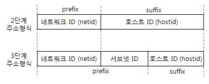
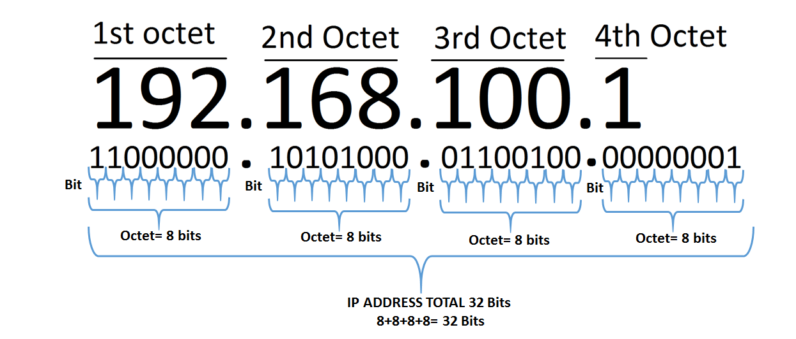
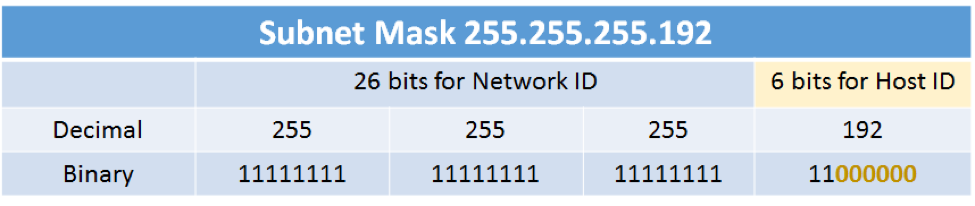
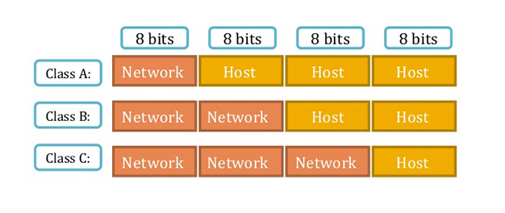
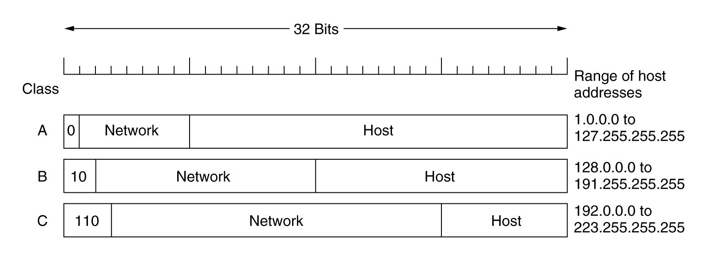
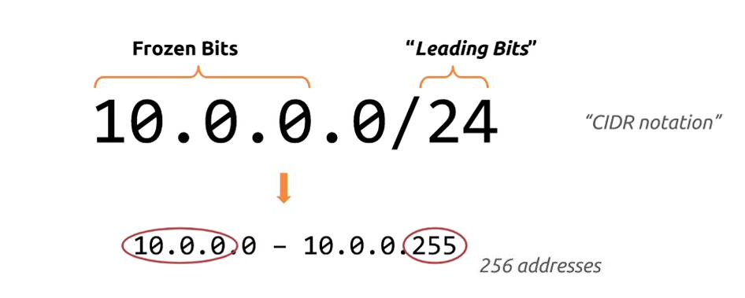
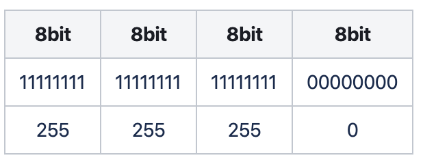
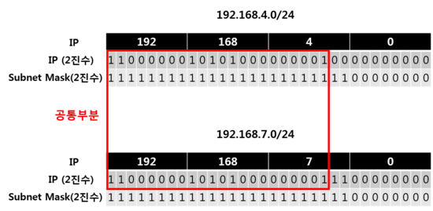

## Subnetting

### 서브넷팅이란?

커다란 네트워크를 여러개의 논리적인 작은 네트워크(`sub network`)로 나누는 것을 뜻합니다. 서브넷 개념을 도입한 네트워크는 기존의 `2단계 주소형식`대신 `서브넷 ID`를 추가한 `3단계 주소형식`을 사용합니다.

여기서 `prefix`는 네트워크를 식별하고 `suffix`는 해당 네트워크의 호스트를 식별하는데, 이 두개가 합쳐져서 타겟 사용자를 식별하는데 사용합니다. `subnetid`는 `prefix`의 크기를 늘리고 `netid`에 속한 서브넷의 개수를 결정하는데 사용됩니다.

 

#### 서브넷팅을 하는 이유

-   브로드캐스팅 영역을 작게하기 위해
-   라우팅 정보의 크기 감소
-   주소 절약

 

#### 인터넷과의 관계

`인터넷`이란 라우터의 집합이므로 `라우터간의 통신`에 의해 인터넷 연결이 이루어집니다. 라우터가 트래픽을 받을 때 에는 `IP 주소`와 `라우팅 테이블`을 비교하여 목적지를 결정하기 때문에 `라우팅 테이블의 크기`가 작아져야 통신성능이 향상됩니다. (하나의 라우터는 여러개의 `랜-인터페이스`로 구성되어 있기 때문에 여러개의 목적지를 가질 수 있습니다.)

 

서브넷팅이 적용되지 않은 라우터는 `라우팅 테이블`에 각각의 `IP`에 대한 목적지를 기술해야 하지만, 서브넷팅이 적용된 라우터는 각각의 `IP 대역`에 대한 목적지만 기술하면 되므로 상대적으로 `라우팅 테이블 크기`가 축소됩니다.

 

**before :**

| Target          | Dest |
| --------------- | :--: |
| 255.255.255.1   | eth0 |
| ...             | eth0 |
| 255.255.255.253 | eth0 |
| 255.255.255.254 | eth1 |

 

**after :**

| Target                          | Dest |
| ------------------------------- | :--: |
| 255.255.255.1 ~ 255.255.255.253 | eth0 |
| 255.255.255.254                 | eth1 |

 

이렇게 `라우팅 테이블의 크기`가 작아지면 패킷의 목적지를 결정할 시간적, 공간적 비용이 절약되므로 인터넷 성능이 향상되는 효과를 함께 얻을 수 있습니다.

 

### 서브넷마스크

인터넷 주소는 4개의 옥텟(`32개의 비트`)로 구성되어 있습니다.

 

하지만 어디까지가 `prefix(netid + subnetid)`이고, 어디까지가 `suffix(hostid)`인지 알 수 없기 때문에 `prefix` 부분을 얻기 위한 마스크 값을 `서브넷마스크`라고 부릅니다.

 

예를 들어 `26개의 비트`를 `prefix`로, 나머지를 `suffix`로 사용하는 서브 네트워크를 생각해보겠습니다. 여기서 `prefix` 부분을 얻기 위해서는 `1`의 개수가 26개, `0`의 개수가 6개인 마스크를 씌우면 됩니다. 즉, 여기서 서브넷 마스크는 `255.255.255.192`가 됨을 알 수 있습니다.

 

### 클래스가 존재하는 서브넷

예전에는 `8비트 단위`로만 `prefix`를 결정할 수 있었고, 이것을 각각 `A, B, C Class`라고 불렀습니다. 클래스가 올라갈 때 마다 `8비트`씩 올라간다는 것이고, 어떤 클래스가 사용되었는지 알 수 있다면 `prefix`도 알 수 있다는 심산이였죠.

 

하지만 어떻게 `클래스`를 판별할 수 있을까요? 정답은 바로 `IP의 시작비트`와 관련되어 있습니다. `IP가 이렇게 시작하면 이 클래스야!`라고 표준으로 미리 정해둔 것이죠.

 

그러나 이 방식에는 몇 가지 문제점이 있었는데 `8비트 단위`밖에 못한다는 것이 가장 큰 단점이였고, `클래스를 알아내기 위한 시작비트`때문에 `netid + subnetid`에 할당할 수 있는 비트가 적어진다는 것도 문제였죠.

 

### 클래스 없는 서브넷

이러한 문제를 해결하기 위해 `사이더(Classless Inter-Domain Routing, CIDR)`라는 개념이 나타났고, 기존의 방식은 `CIDR`를 사용하는 방식으로 대체되었습니다. `CIDR` 표현법은 `Based IP / Leading Bits` 형태로 `prefix`를 결정하는데, `Based IP`에서 `Leading Bits`개 만큼 `prefix`로 사용되었다는 것을 의미합니다. 여기서 결정된 `prefix`를 `Frozen Bits`라고 합니다.

위의 그림을 예시로 들어보겠습니다. `Base IP(10.0.0.0)`에서 `Leading Bits(24)`개 만큼 `prefix`로 사용하므로 `10.0.0`이 `Frozen Bits(prefix)`가 되고 나머지가 `hostid`로 사용됩니다. 여기서 무엇보다 중요한 것은 `Leading Bits`는 8단위 제약과 시작비트 제약이 없기 때문에, 보다 유연하게 서브 네트워크를 표현할 수 있다는 것이죠.

 

`CIDR`은 `Class`보다 유연한 개념이므로 `Class`를 `CIDR`로 표현할 수 있습니다. 예를 들어, `C Class`는 `/24`로 표현될 수 있습니다.

 

### 특수 호스트

각각의 서브 네트워크에서 전체 호스트의 개수는 `2 ^ sizeof(hostid)`개 이지만, 특별한 용도를 갖는 2개의 호스트를 가져야하기 때문에, 실제 사용할 수 있는 호스트의 개수는 `2 ^ n(hostid) - 2`개 입니다.

-   `첫번째 호스트 (hostid가 전부 0)` : 기본 게이트웨이
-   `마지막 호스트 (hostid가 전부 1)` : 브로드캐스트

 

### 단골 문제

대기업의 공개채용 필기시험에 빠지지 않고 나옵니다.

-   주어진 `CIDR`에서 `기본 게이트웨이 주소`는?
-   주어진 `CIDR`에서 `브로드캐스트 주소`는?
-   주어진 `CIDR`에서 `전체 호스트의 개수`는?
-   주어진 `CIDR`에서 `실제로 컴퓨터에 할당할 수 있는(유효한) 아이피의 개수`는?
-   주어진 `CIDR`에서 `첫번째 아이피 주소`는?
-   주어진 `CIDR`에서 `마지막 아이피 주소`는?

 

## Supernetting

### 슈퍼넷팅이란?

`서브넷팅`이 큰 네트워크를 잘게 나누는 것이라면, `슈퍼넷팅`은 작은 네트워크의 `공통된 prefix`를 취하여 크게 합치는 개념입니다.

 

### 슈퍼넷팅을 하는 이유

서브넷팅을 하면 `라우팅 테이블의 크기`가 작아진다고 설명했지만, 과한 경우에는 오히려 `라우팅 테이블의 크기`가 커질 수 있습니다. 이런 경우에는 적당히 서브 네트워크를 합치는 것이 `라우팅 테이블의 크기`를 줄일 수 있습니다.

 

### 슈퍼넷팅 계산

N개의 서브넷을 병합하려면, 먼저 공통된 `prefix`를 구하고 다시 `CIDR`로 표현하면 됩니다. 예를 들어서, 두 개의 서브넷 `192.168.4.0/24`와 `192.168.7.0/24`은 공통된 `prefix`인 `11000000 . 10101000 . 000001xx . xxxxxxxx`를 가지고 있으므로, 이것을 `CIDR`로 다시 표현하면 `192.168.4.0/24`가 됩니다. 이것이 슈퍼넷팅된 네트워크의 주소입니다.

 

### 단골 문제

`슈퍼넷팅`은 그다지 많이 출제되지 않지만, 푸는 방법은 `서브넷팅`과 동일합니다. 첫번째와 마지막이 `게이트웨이`와 `브로드캐스트`로 사용되는 것부터 시작하여, 모든 문제풀이 방식이 `서브넷팅`과 동일합니다.

 

## References

-   [정보통신기술용어해설](http://www.ktword.co.kr/abbr_view.php?nav=&m_temp1=961&id=846)
-   [네이버 블로그 - 훈돌픽](https://blog.naver.com/gnsehfvlr/221022863603)
