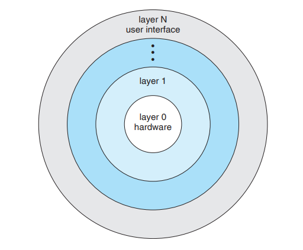
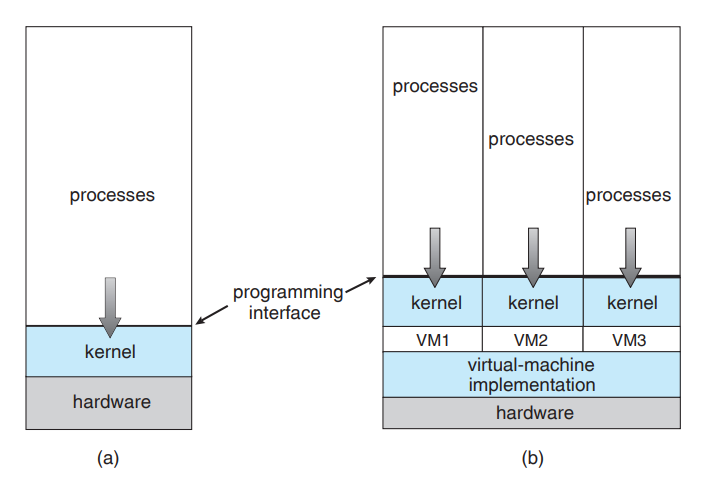
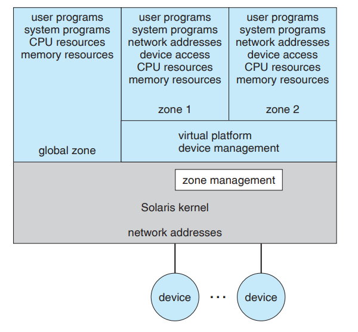

# 운영체제 서비스

각각의 운영체제는 `설계된 목적`과 `자신만의 고유한 기능`이 있습니다. 운영체제들은 해당 목적을 효율적으로 달성하기 위해 각기다른 디자인과 알고리즘을 선택하지만, 보편적으로 다음 기능들은 공통으로 제공됩니다.

 

## 단일 사용자 기능

### 사용자 인터페이스

운영체제는 하드웨어와 사용자 사이를 중재하는 소프트웨어이므로, 사람이 사용하기 편리한 형태의 인터페이스를 제공해야 합니다. 보통 `CUI` 또는 `GUI`중 하나를 선택하지만, 경우에따라 두 개 다 지원하는 운영체제도 있습니다.

 

### 프로그램 실행

운영체제는 `폰 노이만 구조`에 따라 프로그램을 메모리에 적재하여 실행시킬 수 있어야 하며, 프로그램이 비정상적으로 종료된 경우에는 원인을 파악한 뒤 디스플레이할 수 있어야 합니다.

 

### 입출력 연산

프로세스는 `파일`, `키보드`와 같은 입출력을 요구할 수 있지만, 사용자들이 입출력 장치들을 `Raw-Level`하게 다루는 것은 효율성과 보안성 측면에서 좋지 않습니다. 따라서 운영체제는 입출력 장치들을 쉽게 제어하고 사용할 수 있도록 인터페이스를 제공해야 합니다.

 

### 파일 시스템 조작

운영체제에서 파일 시스템은 매우 중요한 구성요소입니다. 각각의 프로그램은 `파일을 생성`할 수 있어야 하고, `파일을 삭제`할 수 있어야 하고, `파일을 탐색`할 수 있어야 합니다. 마지막으로 보안성을 위해 `사용자 또는 그룹에 기반한 소유권을 설정`하여 액세스를 허가하거나 거부할 수 있어야 합니다.

 

### 통신

한 프로세스가 다른 프로세스와 정보를 교환하는 것은 드문일이 아니며, 이러한 기능을 `프로세스 간 통신`(`Inter-Process Communication`, `IPC`)라고 합니다. 두 프로세스가 같은 컴퓨터에 있는지, 다른 컴퓨터에 있는지에 따라 솔루션이 제각기 다릅니다.

 

-   `같은 컴퓨터에 있음` : 공유 메모리 기법, 메세지 전달 기법, 파이프 기법
-   `다른 컴퓨터에 있음` : 네트워크 통신

 

`같은 컴퓨터 내의 프로세스간 통신`에 대해서는 `챕터 3`에서 다룹니다.

 

### 오류 탐지

오류는 `하드웨어적`, `소프트웨어적`, `우연히`, `의도적` 또는 `악의적`으로 발생할 수 있으며, 운영체제는 발생가능한 모든 오류를 항상 의식하고 복구할 수 있는 알맞은 행동을 수행해야 합니다. 사용자에게 디버깅 도구도 제공할 수 있어야 합니다.

 

## 다중 사용자 기능

### 자원 할당

`서버`와 같이 여러 사용자들이 동시에 접근할 수 있는 경우에는 `다수의 사용자`에 의해 `다수의 프로세스`가 실행될 수 있습니다. 이런 경우에는 `각 사용자마다 제공할 수 있는 자원의 상한성`을 정하는 것이 중요한 의제일 수 있습니다.

 

### 회계

`클라우드`같은 경우에는 얼마나 자원을 많이 사용했는지에 따라 청구서가 출력됩니다. 따라서 `누가` `무엇을` `얼마나` 사용했는지 추적할 수 있어야 합니다. 이러한 기능은 효율적으로 시스템을 재구성하고자 하는 연구자에게 귀중한 재료가 됩니다.

 

### 보호와 보안

어떤 사용자가 실행한 프로세스가 `다른 사용자의 프로세스` 또는 `운영체제`를 방해해서는 안되며, 자신의 것이 아닌 자원을 맘대로 다룰 수 있어서도 안됩니다. 위의 두 가지 이슈를 방어하는 것을 `보호`라고 하며, 사용자들의 신분을 정확하게 판별하는 것을 `보안`이라고 합니다.

 

# 시스템 호출

`시스템 호출`(`System Call`)은 커널이 제공하는 서비스를 사용자가 쉽게 사용할 수 있도록 제공된 인터페이스이며, 대부분의 경우 `C/C++`로 래핑되어 있습니다. 이름에서도 알 수 있듯이 `시스템 콜`이 실행되면, 해당 `시스템 콜`을 처리하는 명령어는 `커널 레벨`에서 수행되기 때문에 `모드 비트`가 0으로 설정됩니다.

 

`시스템 콜`이 제공되는 중요한 이유 중 한가지는 `사용자에게 적절한 보안과 추상화`를 제공하기 위해서입니다. `Hello, World!`를 출력하는 프로그램만 하더라도 수 많은 운영체제의 구성요소들을 건드리기 때문입니다. 대부분의 사용자 또는 프로그래머가 해당 과정에서 발생하는 수 많은 인터널들을 숙지하는 경우는 극히 드뭅니다. `시스템 콜`은 운영체제의 일부분(`파일 시스템`, `장치`, ...)을 쉽게 다룰 수 있도록 도와줍니다.

 

## 표준 라이브러리

다만 `시스템 콜`은 각각의 운영체제 버전마다 스펙이 다를 수 있으므로, `버전 호환성`을 지키기 위하여 `표준 라이브러리`(예를 들어, `C/C++`에서는 `stdio.h`)의 형태로 제공됩니다. 운영체제가 버전업 되더라도 이전 버전에서 제공되었던 `표준 라이브러리`를 사용할 수 있도록 설계됩니다.

 

## 시스템 호출의 유형

`시스템 콜`이 다루고 있는 공통적인 범주는 다음과 같습니다.

 

### 프로세스 제어

-   프로세스 생성, 중지, 복제
-   프로세스 속성을 설정하거나 획득
-   특정 시간만큼 기다림 (sleep)
-   특정 사건을 기다리거나, 특정 사건을 일으킴 (signal)
-   메모리를 할당하거나 해제 (allocate)

 

### 파일 조작

-   파일 생성, 삭제
-   파일 열기, 닫기
-   파일 읽기, 쓰기, 위치 변경
-   파일 속성을 설정하거나 획득

 

### 장치 관리

-   장치의 사용권을 획득하거나 돌려줌
-   장치에서 데이터를 읽거나, 장치에 데이터를 씀
-   장치의 속성을 설정하거나 획득
-   장치를 운영체제에 논리적으로 부착(attach)하거나 분리함(detach)

 

### 정보 유지

-   컴퓨터 시간의 설정과 획득
-   시스템 데이터의 설정과 획득
-   프로세스, 파일, 장치 속성의 설정과 획득

 

### 통신

-   통신의 생성, 제거
-   메세지의 송신, 수신
-   통신 상태 획득
-   원격 장치의 부착 및 분리

 

# 운영체제 구조

## 모놀리식 커널 접근법

옛날 운영체제들은 필요한 `모든 기능들이 하나의 프로그램으로 합쳐된 형태`로 작성되었습니다. 이렇게되면 운영체제 자체는 작성하기는 쉽지만, 추후에 확장이 어렵고, 서브기능 중 하나가 멈췄다면 시스템 전체가 멈추게 됩니다.

 

## 계층적 커널 접근법

`OSI 7 Layer`를 생각하면 이해하기 편합니다. `하위 계층의 기능들만 사용하여 상위 계층을 구현`하는 형태로 작성됩니다. `Layer 0`인 하드웨어 계층부터 시작해서 `Layer N`인 사용자 인터페이스 계층으로 올라가는 형태입니다.

 

각 계층별로 나뉘어서 `디버깅`이 매우 편해졌지만, 설계 당시에 계층을 적절히 잘 정의해야 하는 단점을 가지고 있습니다. 자기 계층보다 낮은 계층들의 기능만 사용할 수 있으므로 올바르지 않은 계층에 위치한다면 구현 자체가 불가능하기 때문입니다. 또한 계층적 구조는 `효율성`에 문제가 있습니다. 계층적 구조에 의해 1단계씩 낮은 계층의 메소드를 연속적으로 호출해야 하는데 `파라미터가 많다면` 당연히 파라미터 전달에 대한 오버헤드가 가중되기 때문입니다.

 

## 마이크로 커널 접근법

따라서 현대의 커널은 `꼭 필요한 기능`만 넣어 크기를 최대한 줄이고, 이외에 필요한 기능들은 `모듈`로 따로 빼내어 작성하는 `마이크로 커널` 방식을 취합니다. `모듈`에서 에러가 발생했다고 하더라도 `커널`에서 에러가 발생한 것임은 아니므로 정상적인 진행이 가능하고, `계층적 구조`가 아니기에 매번 레이어를 낮춰서 전달하는 것이 아니라, `원하는 모듈로 바로 파라미터 전달이 가능`하여 파라미터 전달에 대한 오버헤드도 없습니다. 마지막으로 `커널`의 기능확장도 용이합니다.

 

다만 `마이크로 커널`은 운영체제와 모듈이 상호작용하는 단계에서 발생하는 오버헤드 때문에 성능이 감소되었습니다. 해당 접근법이 처음 나왔을 당시에는 하드웨어 스펙이 부족했기 때문에 `Windows XP`가 설계되기 전까지 `모놀리식 커널`에 가깝게 구현되었습니다.

 

## 가상화

### 전가상화

`계층적 커널 접근법`은 추후에 `가상화`에서 결실을 맺게 되었습니다. `하드웨어를 추상화한 계층`(=`하이퍼바이저`)을 새롭게 만들어 `커널`이 `하드웨어`를 직접 이용하는 대신에 `하드웨어 추상화 계층`을 사용하도록 만드는 것입니다. 이러한 접근을 통해 컴퓨터의 하드웨어를 동일한 하드웨어를 공유하면서도 다수의 각기다른 실행환경을 제공할 수 있게 되었습니다.

다만 `가상화`에서 동작하는 `커널`들은 `추상화된 하드웨어 계층`을 사용하게 되므로 필연적으로 `하드웨어 효율성을 포기`할 수 밖에 없습니다. 매번 `하드웨어 대리자`를 통하는 것 보다 `직접 하드웨어를 사용`하는 것이 더 빠른게 당연하겠죠.

 

### 반가상화

`반가상화`는 바로 위에서 언급된 이슈를 해결할만한 솔루션으로 대두되었습니다. 말 그대로 `절반만 가상화 하자`는 것 입니다. 어느 커널은 `추상화된 하드웨어 계층`을 이용하고 어느 커널은 `바로 하드웨어를 사용하자`는 것이죠.

 

바로 하드웨어를 사용하는 호스트를 `전역 영역`(`Global Zone`)이라고 부르며 `하이퍼바이저`를 경유하는 호스트를 `컨테이너`(`Container`) 또는 `일반 영역`(`Zone`)이라고 부릅니다. 아래는 2개의 컨테이너를 거느리는 솔라리스의 모식도입니다.

