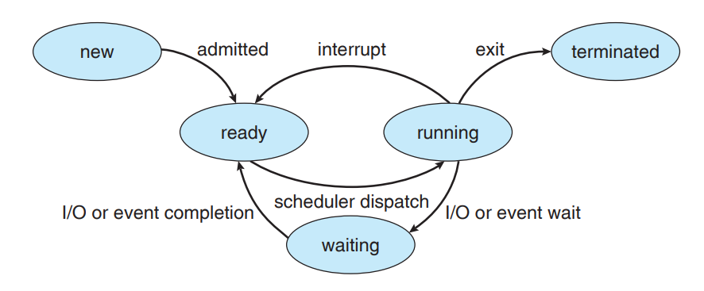

# 프로세스

## 프로세스의 개념

비공식적으로 `프로세스란 실행 중인 프로그램`을 가르킵니다. 다음과 같이 `텍스트 영역`, `데이터 영역`, `힙 영역`, `스택 영역`, `자유 공간`이 할당된 `프로그램 이상의 개념`이며 `프로그램 카운터`를 갖는 `능동적 개체`입니다. `잡`(`Job`)은 프로세스의 별칭입니다.

<br/>

## 프로세스의 상태

프로세스는 실행되면서 그 상태가 변화합니다. 각 프로세스는 다음 상태들 중 하나입니다.



-   `생성 (New)` : 프로세스가 생성 중 입니다.
-   `실행 (Running)` : 해당 프로세스의 명령어가 실행 중 입니다.
-   `대기 (Waiting)` : 입출력의 완료 신호를 기다리고 있습니다.
-   `준비 (Ready)` : 프로세스의 실행 순번이 오길 기다리고 있습니다.
-   `종료 (Terminated)` : 프로세스가 종료되었습니다.

<br/>

한 가지 시나리오를 통해 변화를 알아보겠습니다. 사용자가 프로그램을 실행하면 `New 상태인 프로세스`가 만들어집니다. 운영체제는 현재 가용할 수 있는 메모리를 확인한 뒤 해당 프로세스를 승인하면 `Ready 상태로 변경`됩니다.

<br/>

다만 하나의 컴퓨터는 여러개의 프로세스를 실행하고 있겠죠? 운영체제는 `Ready 상태의 프로세스 중 하나를 선택하여` 실행합니다. 여기서 선택된 프로세스가 `Running 상태`로 변화합니다.

<br/>

`Running 상태`의 프로세스는 여러가지 입출력을 요청할 수 있습니다. `사용자에게 키보드 입력을 받는다`거나 `파일을 읽는다`거나 `파일을 쓴다`거나 말이죠. 프로세스는 입출력이 완료될 때 까지 기다려야합니다. 입력 또는 출력작업이 끝나지도 않았는데 다음 단계로 넘어가면 안되겠죠?

<br/>

이런식으로 `Running 상태`의 프로세스가 입출력을 요청하면 `Waiting 상태`로 변화하며 입출력의 완료 신호가 감지될 때 까지 대기합니다. 입출력이 완료되면 `Waiting 상태`의 프로세스는 `Ready 상태`로 변화하며 다시 자기의 차례가 돌아오기를 기다립니다.

<br/>

`Running 상태` 프로세스의 모든 작업이 끝나면 `Terminated 상태`로 변화하며 운영체제가 종료된 프로세스에 할당했던 메모리를 회수합니다.

<br/>

## 프로세스 제어 블록

`프로세스 제어 블록`(`Process Control Block, PCB`)는 특정 프로세스에 관련된 정보들을 저장합니다.

<br/>

**여기에 포함된 정보 :**

-   `프로세스 상태` : 해당 프로세스의 현재 상태를 가르킵니다.
-   `프로그램 카운터` : 해당 프로세스가 다음에 실행할 명령어의 주소를 가르킵니다.
-   `CPU 레지스터 백업본` : 인터럽트에서 복귀했을 때 사용합니다.
-   `CPU 스케쥴링 정보` : 스케쥴링에서 사용되는 매개변수의 값을 저장합니다.
-   `메모리 관리 정보` : 해당 프로세스가 사용중인 `메모리`와 `페이징` 정보를 저장합니다.
-   `통계 정보` : 해당 프로세스가 사용한 CPU, 시간, 프로세스 식별자 등을 저장합니다.
-   `입출력 상태 정보` : 해당 프로세스가 소유한 입출력장치 또는 파일 목록을 가르킵니다.

<br/>

## 프로세스 개념의 확장

위에서 설명했던 프로세스 모델은 `하나의 프로세스가 하나의 쓰레드를 갖는다`고 가정했습니다. 해당 모델의 문제점은 `두 작업을 병렬로 할 수 없다`라는 것 이겠죠. 예를 들어 `하나의 파일을 읽는 작업`이 2개 있다고 했을 때, 두 작업 중 하나만 실행될 수 있고. 먼저 실행된 작업이 프로세스를 `Waiting 상태`로 변화시키므로 2개의 파일을 동시에 읽을 수 없습니다.

<br/>

위의 이슈를 해결하기 위해 현대 운영체제는 `쓰레드`(`Thread`) 개념을 사용하여 프로세스를 더욱 확장합니다. 하나의 프로세스를 여러개의 쓰레드로 나누고 `여러개의 대기 프로세스 중 하나를 선택`하는 것이 아니라 `여러개의 대기 쓰레드 중 하나를 선택`하도록 확장하는 것 이죠.

<br/>

# 스케줄링

## 장기 스케줄러

현대 시스템은 `가용 CPU 코어 수`보다 `실행해야 할 프로세스 수`가 훨씬 많습니다. 따라서 `즉시 실행할 수 없는 프로그램`도 생기겠죠. 이처럼 실행이 요청되었지만 즉시 자원을 할당받지 못한 프로세스는 `실행대기 큐`에 옮겨지며 나중에 운영체제에게 선택될 때 까지 대기합니다.

<br/>

새롭게 실행할 프로그램을 선택하는 것은 매우 신중해야 합니다. `CPU 중심의 프로그램`과 `I/O 중심의 프로그램`의 개수를 균형있게 조절해야 최선의 성능을 이끌어낼 수 있기 때문이죠. 따라서 `장기 스케줄러`는 오랜시간을 심사숙고하여 `실행대기 큐`에서 새롭게 실행할 프로그램 하나를 선택합니다. 마침 실행요청은 그렇게 자주 일어나는 일이 아니므로, 더 오랜시간 생각해도 괜찮습니다. 선택된 프로그램은 `프로세스`로 지위가 올라가며 `준비완료 큐`로 이동됩니다.

<br/>

다만 `유닉스` 또는 `윈도우`같은 `시분할 시스템`은 `장기 스케줄러`가 없는 경우도 있습니다.

<br/>

## 단기 스케줄러

같은 맥락으로 `가용 CPU 코어 수`보다 `준비완료된 프로세스 수`가 훨씬 많습니다. 운영체제가 자원을 할당했어도 아직 자기 차례가 되지 않은 프로세스는 `준비완료 큐`에 옮겨지며 자신이 선택 될 까지 대기합니다.

<br/>

하나의 `프로세스`가 오랜시간동안 `CPU`를 독점하면 안되기 때문에 `단기 스케줄러`는 매우 빈번하게 `준비완료 큐`에서 다음에 실행할 프로세스를 선택해야 합니다. 다음에 실행할 프로세스를 선택하면 `인터럽트`를 보내 현재 실행중인 프로세스를 일시정지시키고 선택된 프로세스를 실행시킵니다.

<br/>

## 중기 스케줄러

`시분할 시스템`과 같은 일부 시스템은 중간 수준의 스케줄링을 도입한 경우도 있습니다. 현대의 시스템은 `준비완료 큐`에 들어있는 프로세스가 너무 많아지는 바람에 `단기 스케줄러`에서 하나를 선택하는 작업이 무거워졌다는 것 이죠.

<br/>

`중기 스케줄러`는 `준비완료 큐`에서 일부 프로세스들을 꺼내서 `다중 프로그래밍 정도`를 낮추는 역할을 합니다. 이러면 `단기 스케쥴러`의 부담이 줄어들고 전체 성능의 향상으로 이어지겠죠.

<br/>

`준비완료 큐`에서 꺼내질 때에는 `할당된 메모리`도 같이 꺼내지는데, 이후에 다시 `준비완료 큐`로 돌아갈 때 `할당된 메모리의 백업본`을 활용하여 이전 상태로 복구됩니다.

<br/>

## 문맥 교환

`단기 스케쥴러`에 의해 현재 실행중인 프로세스가 바뀌는 상황은 매우 흔합니다. 하지만 실행중인 프로세스가 바뀌었다고 `이전 정보`가 손실되면 안되겠죠. `프로세스가 교체될 당시의 CPU 레지스터 값`을 포함한 다양한 정보들을 `문맥`이라고 하며 `PCB`에 저장되어 있습니다. 프로세스가 교체될 때 마다 `해당 프로세스의 문맥`을 복구하는 작업이 요구되며, 이것을 `문맥 교환`이라고 부릅니다.

<br/>

`문맥 교환`도 당연히 오버헤드가 존재하는 작업이며 `PCB`에 저장된 정보가 많아질수록 `문맥 교환`의 비용도 증가합니다. 즉, 프로세스를 관리하기 위한 정보들이 많아질수록 `문맥 교환`의 비용도 증가합니다.

<br/>

# 프로세스 연산

## 프로세스 생성

### PID

새롭게 프로세스가 생성되면 운영체제는 `고유한 프로세스 식별자 (PID)`를 할당합니다. `PID`를 통해 각각의 프로세스를 구분할 수 있죠. 특별한 프로세스는 `PID가 고정`되어 있습니다. 예를 들어 `솔라리스`에서 첫 번째로 실행되는 `sched` 프로세스는 항상 `PID`가 0으로 고정되어 있습니다.

<br/>

### 트리 구조

대부분의 운영체제에서 프로세스는 `트리 형태`로 관리됩니다. 즉, `부모 프로세스`에 의해 `자식 프로세스`가 생성되는 형태이죠. 보통 `부모 프로세스`가 필요한 기능을 `자식 프로세스`에게 시키기 위해 사용되기 때문에, 이를 위해 운영체제는 `자식 프로세스의 종료를 알리는 기능` 또는 `부모 자식간의 통신 파이프를 생성하는 기능`을 함께 제공해야 합니다.

<br/>

`자식 프로세스`는 `부모 프로세스`가 소멸할 때 같이 소멸되도록 운영체제가 관리하지만, 매우 가끔 `자식 프로세스`만 살아남는 경우가 있습니다. 이렇게 `부모 프로세스`가 사라졌음에도 실행되고 있는 프로세스를 `좀비 프로세스`라고 부릅니다.

<br/>

### 프로세스 복제

`부모 프로세스`는 다양한 프로그램을 `자식 프로세스`로 가질 수 있지만 `자기 자신을 복제`하는 경우도 꽤 있습니다. 이러한 기능은 `fork()`를 호출하여 사용할 수 있으며, `부모 프로세스`에게는 `복제된 자식 프로세스의 PID`를 반환하고 `자식 프로세스`에게는 `0`을 반환합니다.

<br/>

`부모 프로세스`의 모든것이 복제되었으므로 당연히 `프로그램 카운터`도 복제됩니다. 즉, 부모 자식이 모두 `fork()`가 실행된 다음 라인부터 실행됩니다.

```cpp
unsigned int pid = fork();

if( pid != 0 ) {
    // 부모 프로세스
}
else {
    // 자식 프로세스
}
```

<br/>

## 프로세스 종료

### 종료 코드

`exit()`가 명시적 또는 암묵적으로 실행되면 운영체제는 `해당 프로세스에 할당되었던 자원을 회수`합니다. 이 때, 프로세스는 자신이 정상적으로 종료되었는지 알리기 위해 `종료 코드`를 함께 반환할 수 있습니다. 정상종료는 오직 `0`이며 다른 값은 비정상종료를 나타냅니다. `부모 프로세스`가 있는 경우 `자식 프로세스의 종료코드`를 수신할 수 있습니다.

```cpp
int main(){
    cout << "Hello, World!";

    //
    // 정상종료 값인 0을 반환하면서 종료.
    // 이것은 exit(0); 과 같습니다.
    return 0;
}
```

<br/>

### 신원 확인

어떤 시스템 콜은 `PID`를 사용하여 특정 프로세스를 강제로 종료시킬 수 있습니다. 다만, 무조건적으로 종료시키는 것은 아니고 운영체제가 `프로세스 트리`를 살펴서 `적절한 권한이 있는 경우에만 허락`됩니다. 다른 사용자의 프로세스를 악의적으로 종료시키는 것을 방지하기 위함입니다.

<br/>

## 프로세스간 통신

### 같은 호스트

통칭 `IPC (Inter-Process Communication)`로 불리며, 서로다른 두 개의 프로세스가 메세지를 주고받는 방식을 의미합니다. 여기서는 `같은 컴퓨터에 있는 프로세스간 통신`을 설명합니다. `다른 컴퓨터에 있는 프로세스간 통신`은 `네트워크 통신`이기 때문입니다.

<br/>

IPC 모델의 종류는 다음이 있으며, 일반적으로 현대의 운영체제들은 이 중에서 하나만 지원하는 것이 아니라 `모든 모델을 지원`합니다.

<br/>

**IPC 모델 종류 :**

-   `공유 메모리 모델` : 공유 메모리 영역을 생성하고, 여기에 문자열을 쓰고 읽어서 통신.
-   `메세지 전달 모델` : 모든 프로세스가 사용가능한 공용 채널을 통해 통신.
-   `파이프 모델` : 두 프로세스만 사용가능한 전체 채널을 통해 통신.

<br/>

### 공유 메모리 모델

기본적으로 프로세스는 서로의 영역에 침범할 수 없도록 운영체제가 제한하고 있습니다. 하지만 `공유 메모리 모델`은 이러한 제한조건을 깨는 것을 운영체제와 합의하고 `각각 자신의 PCB에 상대방 세그먼트 주소를 기록`합니다. 이후로 두 프로세스는 `공유 세그먼트`를 통해 같은 데이터를 공유할 수 있지만 `공유자원 문제`도 같이 따라오기에 조심해서 사용해야 합니다.

<br/>

### 메세지 전달 모델

운영체제에서 지원하는 `공용 채널`을 사용하여 메세지를 주고받습니다. `우편배달`을 생각하면 쉽습니다. `편지`를 작성할 때와 똑같이 `보내는 사람`과 `받는 사람`이 필요하며, 이것은 `보내는 프로세스의 PID` `받는 프로세스의 PID`에 대응됩니다.

<br/>

현실에서도 그렇듯이 `편지가 중간에 사라지는 경우`가 있음을 인지해야합니다. 이러한 현상의 허용여부에 따라 `봉쇄형` `비봉쇄형`으로 나뉩니다. 이것을 보통 `동기화`라고 부릅니다.

-   `봉쇄형 송/수신` : 메세지가 성공적으로 전송될 때 까지 메세지를 반복적으로 전달.
-   `비봉쇄형 송/수신` : 1번만 메세지를 보내고 성공여부만 반환.

<br/>

`동기화 옵션`은 `송신/수신`에 서로 다르게 적용될 수 있습니다.

-   `봉쇄형 송신` : 소비자가 메세지를 받을 때 까지 대기
-   `봉쇄형 수신` : 송신자가 메세지를 보낼 때 까지 대기
-   `비봉쇄형 송신` : 메세지를 보내고 자기는 하던일을 다시 시작
-   `비봉쇄형 수신` : 수신된 메세지가 없다면 null로 해석하고 하던일을 다시 시작

<br/>

당연하지만 해당 모델은 `공유자원 문제`가 발생하지 않습니다.

<br/>

### 파이프 모델

컴퓨터 공학에서는 제약이 강할수록 예외사항이 줄어들기 때문에 인터페이스가 간단해지죠. `파이프 모델`은 가장 까다로운 제약 조건을 가졌지만 사용법이 간단합니다. 두 프로세스를 직접적으로 잇는 채널을 `파일`로 제공합니다. 두 프로세스는 해당 `파일`에 데이터를 적거나 읽어서 메세지를 교환합니다.

<br/>

`공유 메모리 모델`과 다른 점은 `파일처럼 보이지만 사실은 메세지 채널`이라는 것입니다. 따라서 `파일`보다는 `파이프`로 해석하는 것이 정확합니다. 구체적으로는 자신이 `파이프`에 적은 내용은 `파이프`를 통해 자신도 다시 읽지 못하고, `파이프`에서 읽은 데이터는 영구히 사라집니다.

<br/>

이것은 `파이프`에 `방향성`이 있다는 것을 의미하며, 다음 중 하나의 `방향성`을 가질 수 있습니다.

-   `단방향 파이프`
-   `양방향 파이프`
    -   `반이중 파이프`
    -   `전이중 파이프`

<br/>

또 하나 중요한 것은 `파이프 이름의 여부`입니다. `파이프`가 생성될 시점에 이름을 붙일 수 있으며, 상대방 프로세스가 `해당 파이프의 이름`을 사용하여 해당 파이프에 접속할 수 있습니다. 다만 `파이프의 이름이 없어도` 파이프에 접속할 수 있는데 이것을 `익명 파이프`라고 하며 `복제된 부모-자식 관계`에서만 사용할 수 있습니다.

<br/>

## 다른 호스트

다른 운영체제에서 실행중인 프로세스와 통신하는 것을 `네트워크 통신`이라고 합니다. 보통 운영체제는 다음과 같은 기법들을 제공합니다.

<br/>

### 소켓 통신

`소켓`은 통신의 단말점(`endpoint`)를 의미하며 `두 소켓이 연결되어 하나의 채널`이 됩니다. `소켓 통신`을 하기 위해서는 `상대방의 네트워크 주소`와 `포트 번호`를 알고 있어야 하며 `소켓 통신`에 사용된 `전송 계층` 프로토콜에 따라 이름이 나뉘어집니다. ex) `TCP 소켓` 또는 `UDP 소켓`으로 나뉘어집니다.

<br/>

### 파이프 통신

파이프의 중간 계층에서 소켓통신이 적용될 수 있습니다.
