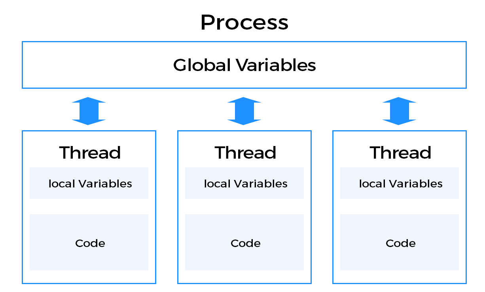

# 스레드

## 개념

`스레드`는 `CPU 이용의 기본 단위`이며 `프로세스`를 이루는 단위이기도 합니다. 각각의 스레드는 `스레드 ID` `프로그램 카운터` `레지스터 집합` `스택`으로 구성되며, 메모리 측면에서 보면 `스레드 개인 메모리 + 프로세스 공유 메모리`에 접근할 수 있습니다.



<br/>

## 왜 필요한가?

현대 운영체에 `스레드`가 도입된 이유는 `종래에는 프로세스가 하나의 동작밖에 하지 못했다`는 것 입니다.

<br/>

첫 번째 예시로 `웹서버`를 생각해보겠습니다. 현대는 `각 클라이언트마다 하나의 스레드를 만들어 대응`하고 있지만, 예전에는 `각 클라이언트마다 하나의 프로세스를 만들어 대응`해야 했기 때문에, 엄청난 병목을 감수할 수 밖에 없습니다. 프로세스를 생성하는 작업은 매우 무겁거든요.

<br/>

두 번째 에시로 `맞춤법을 교정해주는 워드프로세서`를 생각해보겠습니다. 이 프로세스는 적어도 2개의 작업이 병렬적으로 돌아가야 합니다.

-   사용자에게 키보드 입력을 받는 작업
-   지금까지 입력된 텍스트의 맞춤법을 검사하는 작업

<br/>

`스레드`가 없다면 각각의 기능을 `프로세스`로 떼어내야 하고, 필연적으로 `유저가 입력했던 텍스트`와 `맞춤법 검사 결과`도 공유해야 합니다. 프로세스간에 메세지를 교환하려면 `IPC`를 사용해야 하므로 오버헤드가 매우 커집니다.

<br/>

만약 이것을 `스레드로 구현했다면` 각각의 기능을 프로세스 대신 스레드로 만들기 때문에 `생성비용이 절약`되고, 스레드는 자신의 속한 프로세스의 공유 메모리에 접근할 수 있으므로 `IPC를 사용하지 않아도 됩니다`.

<br/>

## 장점

위의 시나리오에서 설명했던 것을 정리하면 스레드를 이용했을 때 다음 장점이 있습니다.

<br/>

### 응답성

프로세스가 멈추는 상황이 줄어듭니다. 스레드가 없다면 `다른 프로세스와의 통신` 또는 `입출력 대기`로 프로세스 전체가 멈추는 상황이 발생하지만, 스레드가 있다면 `일부 스레드만 멈추기 때문에` 프로세스 전체가 멈추는 경우가 줄어듭니다. 이것은 프로세스의 응답속도 향상으로 이어집니다.

<br/>

### 자원 공유

프로세스간의 통신은 `IPC`밖에 방법이 없으며, 이것은 매우 비싼 연산입니다. 스레드는 `동일 프로세스의 공유 메모리에 접근`할 수 있으므로 자원을 공유하는 오버헤드를 줄일 수 있습니다.

<br/>

### 경제성

프로세스를 만드는 비용보다 `스레드를 만드는 비용이 훨씬 가볍습니다`. 책의 예시를 빌리자면 `생성시간은 5배 빠르고` `문맥교환은 30배 빠르다`고 설명하고 있습니다.

<br/>

### 규모 가변성

나눠진 스레드는 `서로다른 처리기에서 동시에 실행될 수 있습니다`. 종래에는 `하나의 프로세스는 하나의 처리기에서만 실행`되었으나 이제는 `하나의 프로세스를 이루는 여러개의 스레드가 서로다른 처리기에서 실행`될 수 있습니다. 쉽게 말하자면 `병렬성`이 증가했다는 것입니다.

<br/>

# 다중 스레드 모델

## 스레드의 종류

스레드는 `시스템 콜의 권한을 가졌는가?`에 따라 명칭이 나뉩니다.

<br/>

-   `커널 스레드` : 시스템 콜의 권한이 `있는` 스레드입니다.
-   `일반 스레드` : 시스템 콜의 권한이 `없는` 스레드입니다.

<br/>

이렇게 나눈 이유는 `보안성`을 위해서입니다. 권한이 없는 스레드가 `시스템 콜`을 이용할 수 없도록 막는것이죠. 일반 스레드가 시스템 콜을 사용하려면 `자신을 담당하는 커널 스레드에 요청`하도록 우회하는 방식을 사용합니다. `요청을 받은 커널 스레드`는 해당 요청이 올바른지 검사하고 동작을 수행합니다.

<br/>

위의 말을 곰씹어보면 `커널 스레드는 일반 스레드를 담당`하고 있다는 것을 알 수 있습니다. `커널 스레드와 일반 스레드의 기수성`에 따라 3가지 모델로 나눠집니다.

<br/>

## 1:1 모델

`하나의 커널 스레드`가 `하나의 일반 스레드`를 담당하고 있는 형태입니다. 일반 스레드 입장에서 자신만의 전용 커널 스레드가 있는 상황이므로 자신이 요청한 `시스템 콜이 커널 스레드에게 즉시 전달되고 처리`됩니다.

<br/>

각각의 일반 스레드는 `자신이 요청한 시스템 콜이 즉각 처리되므로 병렬성이 증가`하지만 응용 스레드가 생성될 때 마다 커널 스레드도 생성되야 하기 때문에 `커널 스레드가 빈번하게 생성되는데 병목`이 걸릴 수 있지만 `스레드 풀`을 도입하여 어느정도 완화할 수 있습니다.

<br/>

현대의 운영체제가 선호하는 모델입니다.

<br/>

## 1:M 모델

`하나의 커널 스레드`가 `여러개의 일반 스레드`를 담당하고 있는 형태입니다. 학교를 생각하면 쉬운데 `한 명의 선생님이 여러명의 학생을 맡고있다`는 것입니다. 위에서 언급했던 `커널 스레드를 생성하는 병목`은 줄어들지만, 하나의 응용 스레드가 시스템 콜을 날리면 `해당 요청이 처리될때 까지 다른 스레드의 시스템 콜이 전부 봉쇄되는`는 단점을 안고 있습니다. 이것은 `병렬성의 저하`로 이어집니다.

<br/>

## M:M 모델

`여러개의 커널 스레드`가 `여러개의 일반 스레드`를 담당하고 있는 형태입니다. 일반 스레드가 시스템 콜을 요청하면 `가용할 수 있는 커널 스레드를 찾아 전달`합니다. 위의 두 모델의 장단점을 균형있게 섞었다고 볼 수 있습니다.

<br/>

## 두 수준 모델

일부 운영체제는 위에 언급된 모델을 `2개 이상` 동시에 사용합니다.

<br/>

## 스레드 풀

커널 스레드를 생성하는 작업은 비싸므로 `생성했던 스레드를 파괴하지 말고 저축`하는 것이 좋습니다. 이렇게 커널 스레드를 재사용하기 위해 저축하는 곳을 `스레드 풀`이라고 부릅니다.

<br/>

# 스레드 연산

## 복제

이전 챕터에서 `프로세스를 복제하기 위해 fork를 사용`했습니다. 하지만 스레드가 도입되었다면 `fork()`의 의미가 애매해질 수 있습니다. 어떤 프로세스의 한 스레드가 `fork()`를 호출했다면 운영체제는 해당 프로세스의 어디까지 복제해야 할까요?

-   해당 프로세스의 `모든 스레드를 복제`하여 새로운 프로세스를 만든다.
-   `해당 스레드만 복제`한 새로운 프로세스를 만든다.

<br/>

위의 논쟁으로 인해 현대 운영체제는 `두 가지 버전의 fork()`를 지원합니다.

<br/>

## 취소

여기서 말하는 `취소`란 스레드가 정상적으로 종료되기 전에 `강제로 종료`하는 것을 일컫습니다. 이 때, 취소의 대상이 되는 스레드를 `목적 스레드`라고 합니다.

<br/>

`목적 스레드`를 종료하는 시점에 따라 2가지로 방식이 나뉩니다.

<br/>

### 비동기 취소

즉시 `목적 스레드`를 종료시킵니다. 이 방식은 문제를 일으킬 수 있는데 `공유 자원을 수정하던 도중에 취소되면` 전체 프로세스 로직의 일관성이 깨질 수 있기 때문입니다.

<br/>

### 지연 취소

`목적 스레드`에 체크표시를 해둡니다. 각각의 스레드는 자신이 체크되어있는지 주기적으로 검사하고 있기 때문에 `체크표시를 인식하면 스스로 종료`합니다. `공유 자원을 수정하던 도중에 취소표시가 적히더라도` 실제 취소는 검사시점에서 이루어지기 때문에 좀 더 안전하게 취소할 수 있습니다. 해당 검사시점을 `취소점`(`cancellation point`)라고 부르며 프로그래머가 임의로 설정할 수 있습니다.

<br/>

```cpp
//
// 공유자원을 조작하는 함수.
// 해당 함수를 실행하는 도중에는 취소되면 안됨.
atomic_transcation();

//
// 자신이 취소되어야 하는가?
if( isCancelled ) {
    exit(0);
}
```

<br/>

## 시그널

특정 이벤트가 발생했다는 표시를 `시그널`이라고 부르며 `프로그램 종료` 또는 `Ctrl-C`와 같은 이유로 인해 발생할 수 있습니다.

<br/>

### 신호 처리기

`시그널`이 발생되면 `프로세스가 가지고 있는 신호 처리기`에 전달되어 처리됩니다. 만약 프로그래머가 `신호 처리기`를 부착하지 않았다면 운영체제가 기본값으로 설정한 `디폴트 신호 처리기`를 사용합니다. 프로그래머가 부착한 신호 처리기는 `사용자 정의 처리기`라고 부릅니다.

<br/>

### 동기, 비동기 신호

발생한 즉시 알려지는 신호를 `동기 신호`라고 하고, 발생했지만 인식할 때 까지 약간의 딜레이가 있는 신호를 `비동기 신호`라고 부릅니다. 대부분 `비동기 신호`로 처리되지만 `0으로 나누기` `불법적인 메모리 접근` 등 매우 민감한 이벤트는 `동기 신호`로 처리됩니다.

<br/>

`동기 신호`는 중대한 사건이 많으므로 `프로세스의 모든 스레드`에 즉각적인 영향을 끼칩니다. `비동기 신호`는 위에서 설명했던 `신호 처리기`에 먼저 들어가며 `다른 프로세스와 통신하라고 알리는 용도`로 자주 사용됩니다. ex) 배치작업이 다 끝났습니다. 다른 프로세스에게도 알려주세요.

<br/>

### 멀티 스레드 환경

신호 처리기 `프로세스가 가지고 있다`는 것에 유의해야 합니다. 싱글 스레드 환경에서는 `스레드가 하나밖에 없으므로` 해당 스레드에 신호를 전달하면 그만이지만, 멀티 스레드 환경에서는 `시그널을 넘길 스레드를 선택`해야 합니다. 일반적으로는 다음과 같은 선택이 있습니다.

<br/>

-   모든 스레드에 시그널을 전달한다.
-   특정 1개 스레드에 시그널을 전달한다.
-   특정 N개 스레드에 시그널을 전달한다.
-   특정 조건으로 각각의 스레드에 시그널 전달 여부를 결정한다.

<br/>

이러한 요구로 인해 `유닉스`는 각 스레드마다 신호의 전달여부를 결정하는 기능을 제공하고 있습니다.
