# CPU 스케줄링

## 개념

하나의 시스템에서 여러개의 프로세스가 실행되고 있을 때 `Running 상태`의 프로세스가 CPU를 사용하지 않는 기능을 요구했다고 가정해봅시다. 예를 들면 `키보드 입력을 기다린다던지` `파일이 전부 읽어질 때 까지 기다린다던지`와 같은 경우가 있겠네요.

  결과적으로는 해당 입출력이 끝날 때 까지 대기해야 하므로 `CPU를 사용할 수 있었지만 대기밖에 못하는 상태`로 볼 수 있겠고, 이것은 `다른 프로세스가 유효하게 사용할 수 있었던 CPU 시간을 낭비`한 것과 같아집니다. 다른 시각에서 보면 `CPU가 놀고있다`라고 볼 수 있겠죠.

 

따라서 운영체제는 `프로세스가 CPU를 사용하지 않는 기능을 실행하면` 그 프로세스는 더 이상 CPU를 유효하게 사용하지 못하므로, 해당 프로세스의 `CPU 이용권을 빼앗아 다른 프로세스에게 부여`해야 합니다.

 

이렇게 `놀고있는 CPU를 만들지 않는 것`을 `CPU 스케줄링`이라고 부릅니다. 스레드를 지원하지 않는 운영체제에서는 `프로세스 스케줄링` 스레드를 지원하는 운영체제에서는 `스레드 스케줄링`이라고 부릅니다.

 

## 작업유형

`프로세스`(또는 `스레드`)에서 요청한 작업은 2가지 유형으로 구분할 수 있습니다.

 

-   `CPU가 필요한` 작업 (= 계산 중심의 작업)
-   `CPU가 없어도 되는` 작업 (= 입출력 중심의 작업)

 

먼저 `입출력 중심의 작업`이 왜 `CPU`를 사용하지 않는 작업인지 이해해야 하는데, 이것은 첫 번째 챕터에서 설명했던 `직접 메모리 접근`가 나왔던 배경을 생각하면 쉽습니다. 그 때 설명했던 내용을 연관지어 설명하자면 :

 

어떤 장치와 대화를 수행하려면 `I/O 인터럽트`가 발생하여 `해당 Device와 통신하는 서비스 루틴`을 실행해야 합니다. 여기서 `서비스 루틴`은 또 다른 명령어의 집합과 마찬가지이므로 `CPU 독점적인 작업`이겠죠. 즉, 원래였다면 `CPU가 해당 서비스 루틴을 실행하는 동안(=해당 디바이스와 입출력하는 동안) 다른 일을 못한다`라는 것 입니다.

 

여기서 `대용량 입출력`이 발생하면 `오랜 시간동안 CPU가 잡혀있게 되겠죠`. 원인은 `CPU가 I/O 인터럽트 서비스 루틴`에 붙잡혀 있는 것이므로 이에 대한 해결책으로 `CPU 대신 서비스 루틴을 실행해줄 처리기`를 삽입하게 됩니다. 이것이 `DMA 처리기`였죠.

 

즉, 해당 연산에 대하여 `CPU 대신 서비스 루틴을 처리해줄 처리기`가 있다면 `CPU가 없어도 되는 작업`이 되는것입니다. 이러한 연산은 십중팔구 `입출력 장치에 대한 연산`이며, 전용 처리기는 `메인보드`에 달려있습니다(ex - `USB` 장치와 대화하기 위한 전용 처리기). 대표적인 예시는 다음과 같습니다.

 

-   키보드 입출력
-   디스크 입출력

 

## 버스트 사이클

즉, 작업은 `CPU-작업` `I/O-작업` 중 하나에 속한다고 볼 수 있습니다. 이러한 작업들이 많이 있으므로 `연속적인 CPU-작업이 뭉쳐진 구간을 CPU Burst` `연속적인 I/O-작업이 뭉쳐진 구간을 I/O Burst`라고 부릅니다. 따라서 `CPU` 입장에서는 `CPU Burst`와 `I/O Busrt`가 교대로 나타나게 되며, 이것을 `Burst Cycle`이라고 부릅니다.

 

## 3줄 요약

`I/O-작업`이 요청되면 입출력이 완료될 때 까지 `CPU를 사용하지 않고 대기`하므로, 해당 `스레드`에 부여되었던 `CPU 사용권`을 빼앗아 `다른 스레드`에 부여하여 `놀고있는 CPU가 없도록` 할 수 있습니다. 다행히 `I/O-작업`은 항상 `인터럽트`와 함께 발생하므로 운영체제는 `I/O-작업`이 실행되는 것을 감지할 수 있습니다.

 

# 스케줄링 알고리즘 개념

## 선점, 비선점

`CPU 사용권`을 어떻게 반납할 지에 따라 `선점(preemptive)`, `비선점(non-preemptive)`으로 나뉩니다.

-   `선점` : 작업이 끝나지 않아도 운영체제에 의해 사용권이 회수될 수 있음.
-   `비선점` : 작업이 끝나야만 사용권이 회수될 수 있음. (=중간에 회수될 수 없음.)

 

`선점`을 전제로 한 알고리즘을 `선점 알고리즘` 그렇지 않은 알고리즘을 `비선점 알고리즘`이라고 부릅니다.

 

## 스케줄링 기준

각각의 스케줄링 알고리즘은 `특징이 서로 다르며` 상황에 따라 적합한 스케줄링 알고리즘이 각각 다릅니다. 하지만 `스케줄링 알고리즘의 특징을 비교`할 때 고려해야 할 사항은 다음과 같습니다.

 

### CPU Utilization

직역하면 `CPU 이용률`입니다. 처리해야 할 작업의 개수가 많은데 `CPU 이용률`이 낮은 상황이 발생하면 안되겠죠.

 

### Throughput

직역하면 `처리량`, `단위 시간당 완료된 작업의 개수`입니다. `완료된 작업`의 개수를 센다는 것에 주의해주세요. 선점 알고리즘이 중간에 CPU를 회수했다면 그것은 `작업이 완료되지 않은 작업`입니다.

 

### Turn-around Time

직역하면 `총처리시간`, `어떤 작업이 완료되기까지 걸린 시간`을 뜻합니다. 여기서 한 가지 더 필요한 것이 있습니다. `Burst Time`이라는 개념인데 `쉬지않고 CPU를 할당했을 때의 예상 처리시간`을 뜻합니다. `선점에 의해 일시정지` 되거나 `앞선 작업이 끝날 때 까지 대기`해야 하는 상황이 발생하면 `Turn-around Time이 Burst Time보다 커질 수 있습니다`.

 

### Waiting Time

직역하면 `대기시간`, `큐에서 얼마나 오래 기다렸는지`를 뜻합니다. 한 시스템에서는 여러개의 작업이 있기 때문에 `작업이 허락되어도 첫 실행까지 딜레이`가 있습니다. 이 딜레이 만큼 `큐에서 기다렸겠죠`.

 

응답시간을 간단하게 계산해보겠습니다. 요청은 `3초`에 들어왔는데, 다른 작업을 처리하느라 `9초`에 실행이 이루어졌다면? 큐에서 기다린 시간은 당연히 `6초`겠죠. 이것이 응답시간입니다. 만약 `선점`이 일어난다면 `실행중인 작업이 (강제로) 큐로 이동`됩니다. 이 경우에도 `큐에서 대기하는 시간이 증가`하므로 대기시간이 늘어납니다.

 

좋은 알고리즘은 `각 작업의 Waiting Time`이 일정수준을 초과하지 않아야 합니다. 극단적인 예시로 `어느 작업에 CPU가 영원히 할당되지 않으면` 해당 작업의 대기시간은 끝없이 올라가겠죠.

 

### Response Time

직역하면 `응답시간`, `요청되고 응답이 발생한 시점까지 얼마나 오래 기다렸는지`를 뜻합니다만, 매우 모호한 기준입니다. `무엇이 응답 시점인지` 사람마다 다르기 때문이죠.

 

-   아직 결과 데이터가 남아있더라도, 첫 번째 결과 데이터가 반환된 시점이다.
-   마지막 결과 데이터가 반환된 시점이다.
-   마지막 결과 데이터가 생성된 시점이다.
-   마지막 결과 데이터가 사용자의 터미널에 출력된 시점이다.
-   ect...

 

예를 들어 `데이터베이스 분야`에서 쓰이는 응답시간의 개념은 첫 번째 예시와 같습니다. 어떤 쿼리의 결과집합이 대용량인 경우, 결과집합을 한번에 보내는 것이 아니라 `N개로 쪼개어` 차례대로 보내는데, `첫 번째 데이터`가 도착한 시점을 응답시간으로 봅니다.

 

## 좋은 알고리즘?

모든 상황에서 사용할 수 있는 `이상적인 알고리즘`은 없습니다. `상황에 따라 최선`인 알고리즘을 사용하고 있을 뿐이죠. 어떤 스케줄링 알고리즘을 도입하려고 적용할 때는 `상황`을 항상 보아야 합니다.

 

`CPU 이용률`과 `처리량`은 높은 것이 좋고, 나머지 항목은 상황에 보고 타협을 해야 합니다. 예를 들어서 `총처리시간을 줄여서 사용자가 기다리는 시간을 줄일려면` 다음과 같이 여러가지 옵션이 있겠지만, 동시에 구현하는 것은 매우 어려우므로 하나만 선택해야 합니다.

-   평균 총처리시간을 줄일것인가?
-   총처리시간의 최댓값을 줄일것인가?
-   총처리시간의 최댓값과 최솟값의 차이(변동폭)를 줄일것인가?

 

# 스케줄링 알고리즘 비교

가장 널리 알려진 스케줄링 알고리즘을 비교하고 각각의 `총처리시간`과 `대기시간`을 측정해보겠습니다.

 

## First-Come First-Served

직역하면 `선입선처리, FCFS 알고리즘` 입니다. 먼저 요청된 순서대로 작업을 수행하며 구현하기 쉽습니다. 다만 `Burst Time이 매우 큰 작업이 먼저 들어오면` 나중에 들어온 작업들의 대기시간이 매우 길어지는 단점을 가지고 있습니다. 이것을 호위효과(`Convoy Effect`)라고 합니다.

위의 작업들을 `FCFS`로 처리하면, 다음과 같은 형태로 처리됩니다.

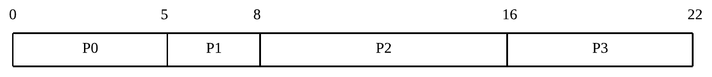

`총처리시간`은 `완료된시각 - 요청된시각`, `대기시간`은 `큐에서 대기한 시간`이므로 각각을 구하고, 각 작업의 평균을 구하면 `평균 총처리시간`과 `평균 대기시간`을 얻을 수 있습니다.

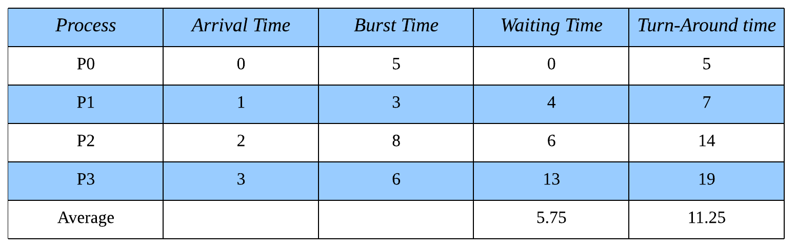

**총처리시간 계산 :**

-   `P0` : `0초에 도착`했고 `5초에 완료`되었으므로 `총처리시간은 5(5-0)초`.
-   `P1` : `1초에 도착`했고 `8초에 완료`되었으므로 `총처리시간은 7(8-1)초`.
-   `P2` : `2초에 도착`했고 `16초에 완료`되었으므로 `총처리시간은 14(16-2)초`.
-   `P3` : `3초에 도착`했고 `22초에 완료`되었으므로 `총처리시간은 19(22-3)초`.

평균 총처리시간은 `(5 + 7 + 14 + 19)/4`로 계산한 `11.25`초.

 

**대기시간 계산**

-   `P0` (총 `0초` 대기)
    -   첫 번째 대기 : `0초` 부터 `0초` 까지 `0초` 대기.
-   `P1` (총 `4초` 대기)
    -   첫 번째 대기 : `1초` 부터 `5초` 까지 `4초` 대기.
-   `P2` (총 `6초` 대기)
    -   첫 번째 대기 : `2초` 부터 `8초` 까지 `6초` 대기.
-   `P3` (총 `13초` 대기)
    -   첫 번째 대기 : `3초` 부터 `16초` 까지 `13초` 대기.

평균 대기시간은 `(0 + 4 + 6 + 13)/4`로 계산한 `5.75`초.

 

## Shortest Job First

직역하면 `최단 작업 우선, SJF 알고리즘` 입니다. `남은 시간이 가장 짧은 작업`을 선택합니다. 검사 시점에 따라 `선점형`, `비선점형`으로 나뉩니다.

 

### 비선점형

선점을 사용할 수 없으므로 `작업이 끝난 시점`에서 검사합니다.

`P0가 끝난 시점`에서 `P1, P2, P3` 모두 요청이 도착한 상태이므로 `셋 중에서 가장 Burst Time이 짧은 P1를 선택`합니다. 만약 `P3의 Arrivail Time이 5보다 컸다면` P0이 끝난 시점에서 P3은 요청되지 않았으므로 고려되지 않았을 것 입니다.

 

다음으로 선택된 `P1이 끝난 시점`에서 `P2, P3 중 가장 Burst Time이 짧은 P3를 선택`합니다. P2가 먼저 요청되었지만 `P3의 Burst Time이 더 짧기 때문`입니다.

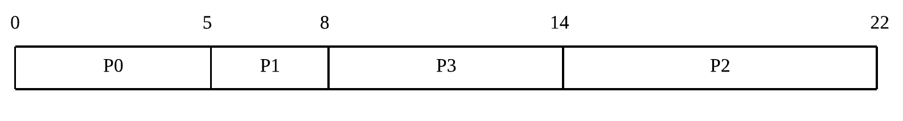

위의 타임라인을 보면 `총처리시간`과 `대기시간`을 쉽게 구할 수 있겠죠. `FCFS`보다 `평균 총처리시간`과 `평균 대기시간`이 줄어든 것을 확인할 수 있습니다.

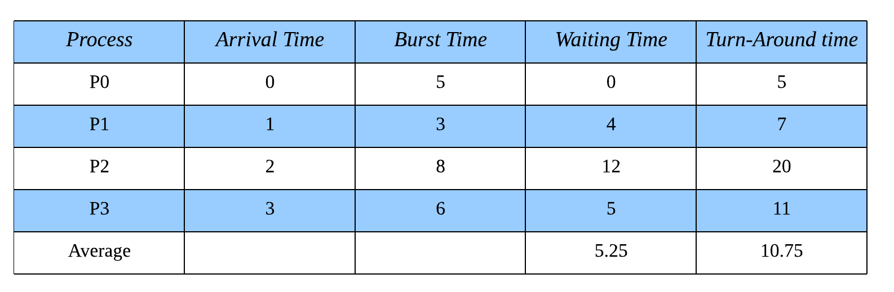

**총처리시간 계산 :**

-   `P0` : `0초에 도착`했고 `5초에 완료`되었으므로 `총처리시간은 5(5-0)초`.
-   `P1` : `1초에 도착`했고 `8초에 완료`되었으므로 `총처리시간은 7(8-1)초`.
-   `P2` : `2초에 도착`했고 `22초에 완료`되었으므로 `총처리시간은 20(22-2)초`.
-   `P3` : `3초에 도착`했고 `14초에 완료`되었으므로 `총처리시간은 11(14-3)초`.

평균 대기시간은 `(5 + 7 + 20 + 11)/4`로 계산한 `10.75`초.

 

**대기시간 계산**

-   `P0` (총 `0초` 대기)
    -   첫 번째 대기 : `0초` 부터 `0초` 까지 `0초` 대기.
-   `P1` (총 `4초` 대기)
    -   첫 번째 대기 : `1초` 부터 `5초` 까지 `4초` 대기.
-   `P2` (총 `12초` 대기)
    -   첫 번째 대기 : `2초` 부터 `14초` 까지 `12초` 대기.
-   `P3` (총 `5초` 대기)
    -   첫 번째 대기 : `3초` 부터 `8초` 까지 `5초` 대기.

평균 대기시간은 `(0 + 4 + 12 + 5)/4`로 계산한 `5.25`초.

 

### 선점형

이번에는 선점을 사용할 수 있으므로 `새로운 작업이 도착한 시점`에서도 검사할 수 있습니다.

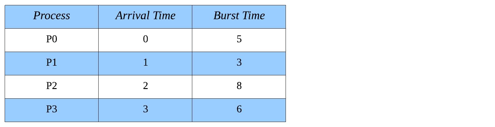

`P0이 처리되고 있는 도중에 P1이 도착`했습니다. `P0을 완료하려면 4초`가 남았지만 `P1을 완료하려면 3초`면 되므로 더 짧은 P1로 교체합니다. 이후에 `P1이 처리되고 있는 도중에 P2, P3가 도착`하지만 P1이 더 짧으므로 교체되지 않습니다. `P1이 완료되면` 남은 시간이 가장 짧은 P0가 선택됩니다.

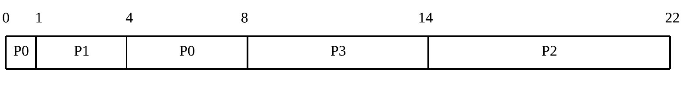

`총처리시간`은 지금까지와 마찬가지지만 `대기시간`은 약간 달라집니다. 중간에 `강제로 선점되어 큐로 돌아가서 대기한 시간`도 포함해야 되기 때문입니다. 즉 `두 번째 대기시간`이 생겨났습니다.

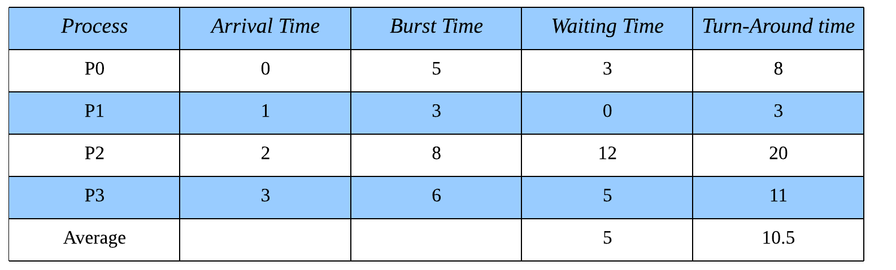

**총처리시간 계산 :**

-   `P0` : `0초에 도착`했고 `8초에 완료`되었으므로 `총처리시간은 8(8-0)초`.
-   `P1` : `1초에 도착`했고 `4초에 완료`되었으므로 `총처리시간은 3(4-1)초`.
-   `P2` : `2초에 도착`했고 `22초에 완료`되었으므로 `총처리시간은 20(22-2)초`.
-   `P3` : `3초에 도착`했고 `14초에 완료`되었으므로 `총처리시간은 11(14-3)초`.

평균 대기시간은 `(8 + 3 + 20 + 11)/4`로 계산한 `10.5`초.

 

**대기시간 계산**

-   `P0` (총 `3초` 대기)
    -   첫 번째 대기 : `0초` 부터 `0초` 까지 `0초` 대기.
    -   두 번째 대기 : `1초` 부터 `4초` 까지 `3초` 대기.
-   `P1` (총 `0초` 대기)
    -   첫 번째 대기 : `1초` 부터 `1초` 까지 `0초` 대기.
-   `P2` (총 `12초` 대기)
    -   첫 번째 대기 : `2초` 부터 `14초` 까지 `12초` 대기.
-   `P3` (총 `5초` 대기)
    -   첫 번째 대기 : `3초` 부터 `8초` 까지 `5초` 대기.

평균 대기시간은 `(3 + 0 + 12 + 5)/4`로 계산한 `5`초.

 

### 치명적인 단점

`SJF`은 고질적인 문제를 가지고 있습니다.

 

첫 번째는 `Burst Time이 큰 작업이 뒤로 계속 밀린다`는 것이죠. 짧은 작업들이 계속 요청되면 `Burst Time이 큰 작업의 순서는 영원히 오지 않을 것`이며, 이것을 기아(`Starvation`)라고 합니다.

 

두 번째는 `Burst Time을 어떻게 계산해야 하는지`모른다는 것 입니다. 예전에 실행했던 경험이 있는 작업이라면 `과거의 기록에서 Burst Time을 추정`할 수 있지만 `정확하게 계산하는 것은 어렵습니다`.

 

## Priority

직역하면 `우선순위` 입니다. `미리 약속한 우선순위에 따라 다음에 실행될 작업을 결정`하며 우선순위가 `남은 Burst Time이 짧은 것`이라고 약속하면 `SJF` 알고리즘과 같아집니다. 즉, `SJF`는 `Priority`의 특별한 케이스입니다. 따라서 `SJF`의 특징을 생각하면 `Priority`의 특징도 얼추 파악할 수 있습니다.

 

1. `비선점` 또는 `선점`이 가능하다.
    - 비선점의 경우, 현재 작업이 끝나고 다음 작업을 결정
    - 선점의의 경우, 새로운 작업이 요청되었을 때에도 다음 작업을 결정
2. `기아`(=`무기한 봉쇄`)가 발생할 수 있다.

 

기아를 해결하는 한 가지 해결 방안은 `노화, Aging`입니다. 시간이 지남에 따라 우선순위를 점차 늘려주는 것 이죠. 처음에는 우선순위가 매우 낮은 작업도 `시간이 흐름에 따라 우선순위가 높아져` 언젠가는 실행될 것 입니다.

 

해당 알고리즘의 계산방법은 `SJF`와 같으므로 생략하겠습니다.

 

## Round Robin

라운드 로빈의 기본 원칙은 `모든 요소를 원처럼 돌아가면서 순회`하는 것 입니다. 즉, `배열의 마지막 요소`의 다음 순서는 `배열의 첫번째 요소`입니다.

 

 

기본적인 동작은 `FCFS`와 같으나 `특정 시간`(`Quantum`)만큼만 실행하고, 퀀텀을 사용했는데도 미처 작업을 완료하지 못했다면 선점되어 대기큐의 마지막으로 돌아가고 `다음 작업을 다시 특정 시간만큼 실행`시킵니다. 이러한 특징으로 인해 `시분할 알고리즘`이라고 불리며 `특정 작업이 CPU를 독점하지 못하게 하는 것`과 같습니다.

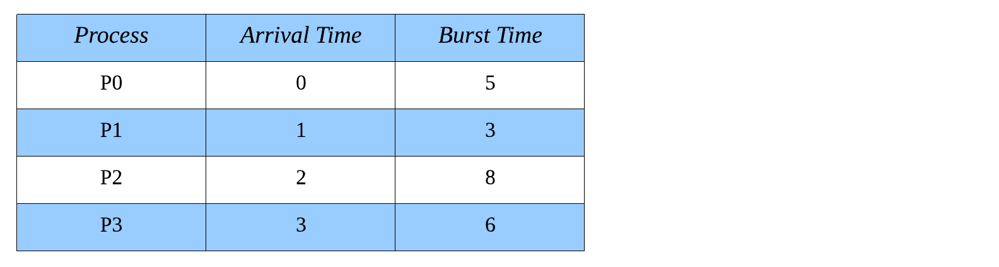

여기서는 `Quantum = 3`으로 정의하고 계산해보겠습니다.

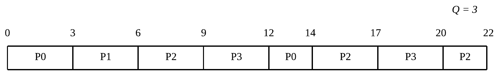

먼저 `P0`을 주어진 시간만큼만 실행하고, 그 다음으로 먼저 들어온 `P1`을 실행합니다. `P1`은 3초만으로 충분하므로 실행된 뒤에는 대기 큐에서 빠져나갑니다. 이것을 반복하면 다음과 같은 타임라인이 만들어집니다.

 

위의 타임라인을 보면 `총처리시간`과 `대기시간`을 간단하게 구할 수 있습니다. 각각의 작업들이 선점되어 대기큐로 돌아갈 수 있으므로 `N 번째 대기시간`이 있다는 것을 염두해야 합니다.

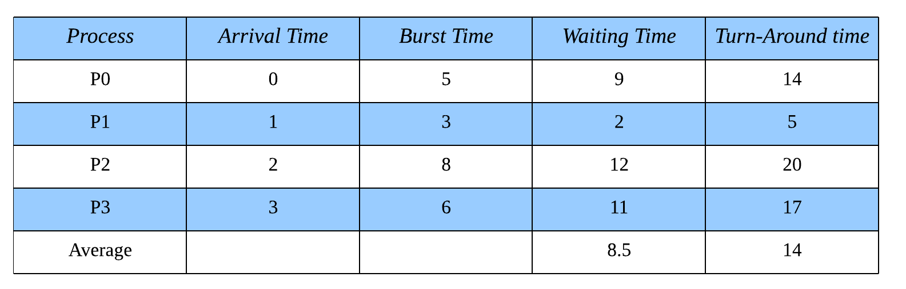

**총처리시간 계산 :**

-   `P0` : `0초에 도착`했고 `14초에 완료`되었으므로 `총처리시간은 14(14-0)초`.
-   `P1` : `1초에 도착`했고 `6초에 완료`되었으므로 `총처리시간은 5(6-1)초`.
-   `P2` : `2초에 도착`했고 `22초에 완료`되었으므로 `총처리시간은 20(22-2)초`.
-   `P3` : `3초에 도착`했고 `20초에 완료`되었으므로 `총처리시간은 17(20-3)초`.

평균 대기시간은 `(14 + 5 + 20 + 17)/4`로 계산한 `14`초.

 

**대기시간 계산**

-   `P0` (총 `9초` 대기)
    -   첫 번째 대기 : `0초` 부터 `0초` 까지 `0초` 대기.
    -   두 번째 대기 : `3초` 부터 `12초` 까지 `9초` 대기.
-   `P1` (총 `2초` 대기)
    -   첫 번째 대기 : `1초` 부터 `3초` 까지 `2초` 대기.
-   `P2` (총 `12초` 대기)
    -   첫 번째 대기 : `2초` 부터 `6초` 까지 `4초` 대기.
    -   두 번째 대기 : `9초` 부터 `14초` 까지 `5초` 대기.
    -   세 번째 대기 : `17초` 부터 `20초` 까지 `3초` 대기.
-   `P3` (총 `11초` 대기)
    -   첫 번째 대기 : `3초` 부터 `9초` 까지 `6초` 대기.
    -   두 번째 대기 : `12초` 부터 `147` 까지 `5초` 대기.

평균 대기시간은 `(9 + 2 + 12 + 11)/4`로 계산한 `8.5`초.

 

라운드 로빈은 `퀀텀의 크기`에 따라 성능이 좌우됩니다. 퀀텀이 크면 `FCFS`와 같아지므로 성능이 떨어지고, 퀀텀이 작으면 빈번하게 일어나는 `선점 연산`(= `문맥 교환`)때문에 성능이 떨어집니다.

 

얼핏보면 `SJF`보다 성능이 떨어지는 것 처럼 보이지만, 두 알고리즘의 목표는 서로 다릅니다. `SJF`는 시스템의 처리량을 최대한 높이는 것을 목적으로 하고, `RR`은 모든 작업을 최대한 공평하게 다루는 것을 목적으로 합니다. 따라서 `RR`은 많은 사용자들이 동시에 사용하는 시스템에 적합합니다.

 

## Multilevel Queue

이것은 알고리즘이 아닌 `매커니즘`입니다. 작업의 특성마다 효율적인 스케줄링 방식이 다를 수 있음을 인정하기 때문에, 하나의 시스템에서 여러개의 `준비완료 큐`를 사용합니다.

 

각각의 큐는 `자신만의 스케줄러`와 `자신만의 스케줄링 알고리즘`을 가질 수 있습니다. 당연하지만 각각의 큐에서 사용되는 알고리즘은 다를 수 있습니다.

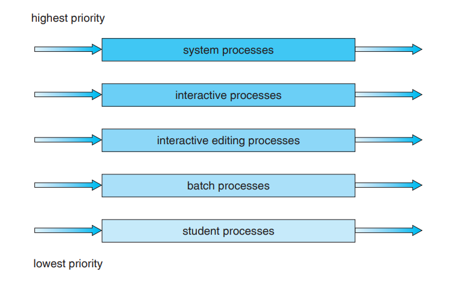

 

## Multilevel Feedback Queue

기존의 `Multilevel Queue`는 작업이 큐 사이를 이동할 수 없었지만 `MFQ는 서로다른 큐 사이의 작업이동을 허용`합니다.

 

첫 작업은 `Q=8`에 삽입하여 짧은 퀀텀을 주다가, 너무 오래 살아남는 것 같다면 `Q=16`로 이동시켜서 퀀텀의 크기를 늘려보고, 이래도 살아남으면 아예 `FCFS`로 이동시켜서 더 이상의 선점없이 작업을 끝낼 수 있습니다.

 

이것은 `Priority`를 사용하지 않고 `노화`를 구현한 것 입니다.

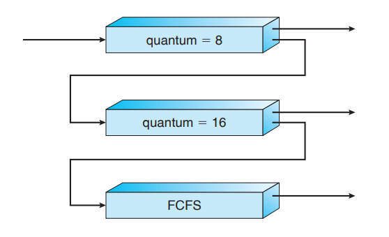
